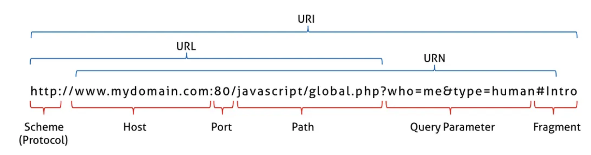
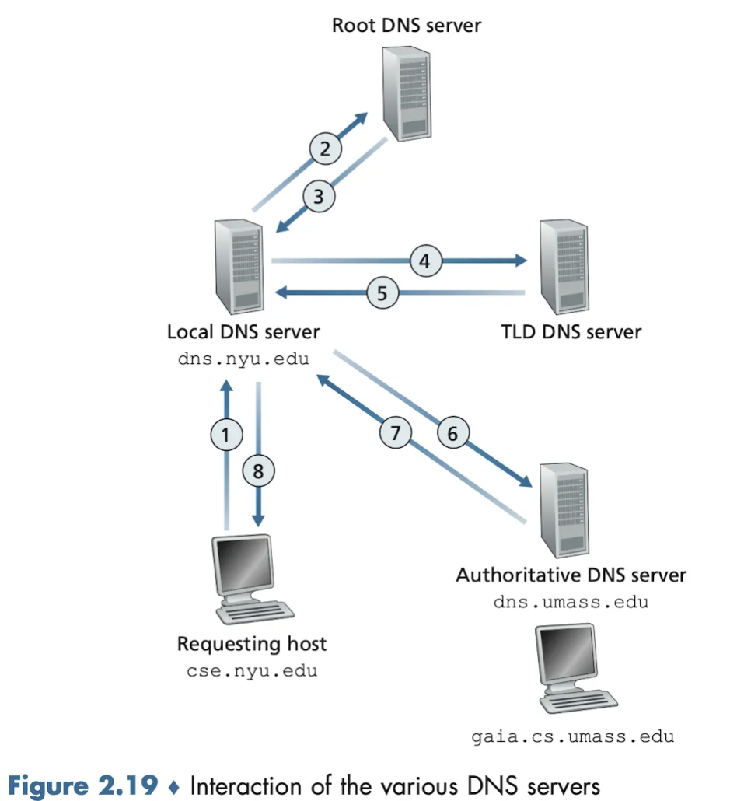
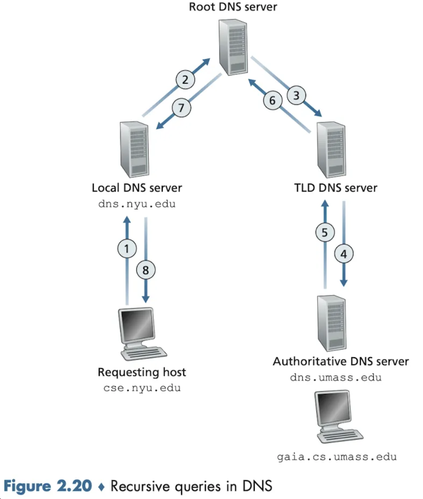
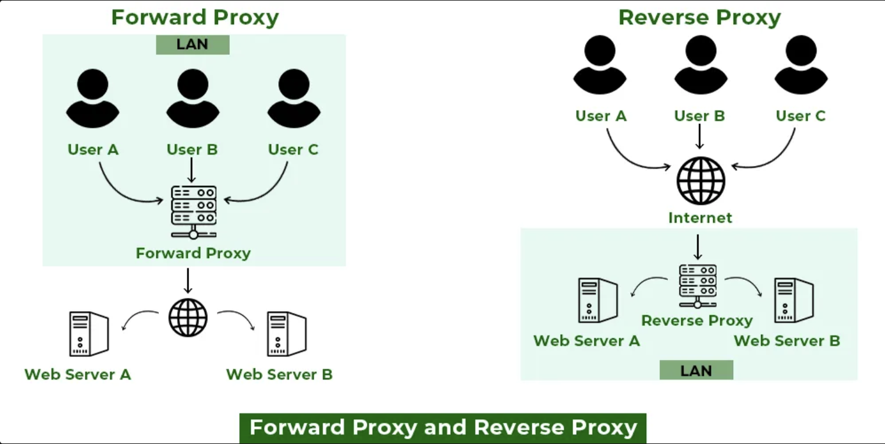

## 💖 네트워크의 기초

**네트워크란 ?**

- 노드(서버, 라우터, 스위치 등)와 링크가 서로 연결되어 있으며 리소스를 공유하는 집합

**좋은 네트워크란 ?**

- 많은 처리량을 처리할 수 있으며 지연 시간이 짧고 장애 빈도가 적으며 보안에 좋은 네트워크
  - 처리량 : 처리한 트래픽의 량(bps)
  - 지연시간 : 요청이 처리되는 시간으로 어떤 메세지가 두 장치 사이를 왕복하는데 걸린 시간
  - 대역폭 : 주어진 시간 동안 네트워크 연결을 통해 흐를 수 있는 최대 비트 수

**네트워크 토폴로지**

- 노드와 링크의 배치 방식이자 연결 형태
- 종류
  - 트리 토폴로지 : 트리(계층) 형태
    - 장점 : 노드 추가/삭제가 용이함
    - 단점 : 트래픽이 집중될 때 하위 노드에 영향을 끼칠 수 있음
  - 버스 토폴로지 : 중앙 통신 회선에 여러개의 노드가 연결된 형태
    - 장점 : 설치비용 적음, 신뢰성 우수, 노드 추가/삭제 용이
    - 단점 : 스푸핑이 발생할 수 있음
  - 스타 토폴로지 : 중앙에 있는 노드에 연결된 형태
    - 장점 : 노드 추가, 에러탐지 용이
    - 단점 : 중앙노드 장애 발생 시 전체 네트워크 사용 불가, 설치비용 높음
  - 링형 토폴로지 : 각 노드가 양옆의 노드와 연결된 고리 형태
    - 장점 : 에러탐지 용이, 충돌 가능성 낮음
    - 단점 : 네트워크 구성 변경이 어려움, 회선 장애 발생 시 전체 네트워크 사용 불가
  - 메시 토폴로지 : 그물망 형태
    - 장점 : 장애 발생 시 다른 경로로 네트워킹 가능, 트래픽 분산 처리 가능
    - 단점 : 노드 추가 어려움, 구축/운용비용높음

**병목현상**

- 전체 시스템이 성능이나 용량등으로 제한을 받는 현상. 병목현상 발생을 막기 위해 토폴로지가 중요하다.
- 성능 분석 명령어 : `ping`, `netstat`, `nslookup`, `tracert`

**네트워크 분류**

- LAN(Local Area Network) : 근거리 통신망, 건물이나 캠퍼스
- MAN(Metropolitan Area Network) : 대도시 지역 네트워크, 도시
- WAN(Wide Area Network)) : 광역네트워크, 국가나 대륙

## 💖 **TCP/IP 4계층**

**TCP/IP 4계층 모델이란 ?**

- 네트워크에서 사용되는 통신 프로토콜을 네트워킹의 범위에 따라 4개의 계층으로 추상화 한 모델
- **애플리케이션 계층**
  - 애플리케이션 계층은 사용자와 직접적으로 상호작용하는 계층
  - 네트워크 통신에 필요한 다양한 응용 프로토콜들이 포함됨
  - 데이터가 최종 사용자에게 전달되기 전에 처리되는 모든 작업을 담당한다.
  - **주요 프로토콜** : HTTP, FTP, SSH, SMTP, DNS, Telnet, POP3, IMAP, SNMP 등
  - **기능** : 사용자 인터페이스와의 상호작용, 데이터 전송 준비
- **전송 계층**
  - 애플리케이션 계층에서 전달된 데이터를 양 끝단에서 정확하고 신뢰성 있게 전송
  - 데이터 전송의 `흐름제어`, `혼잡제어`, `오류제어` 등을 담당합니다.
  - **주요 프로토콜**: TCP (Transmission Control Protocol), UDP (User Datagram Protocol)
  - **기능**
    - **TCP**
      - 연결 지향형 프로토콜
      - 데이터의 신뢰성 있는 전송을 보장하기 위해 흐름 제어, 오류 수정, 세그먼트 재조립 등을 처리
    - **UDP**
      - 비연결형 프로토콜
      - 데이터의 빠른 전송을 제공하지만 신뢰성을 보장하지 않음
      - 오버헤드가 적음
- **인터넷 계층**
  - 네트워크 간의 통신을 가능하게 하는 계층
  - 데이터를 목적지 주소로 라우팅하고 전송(인터넷 상의 패킷을 처리함)
  - **주요 프로토콜**: IP (Internet Protocol), ARP (Address Resolution Protocol), ICMP (Internet Control Message Protocol)
  - **기능**
    - **IP :** 주소 지정 및 라우팅을 통해 데이터(패킷)을 목적지 까지 전달
    - **ARP**: 네트워크 내에서 MAC 주소를 찾는 프로토콜
    - **ICMP**: 네트워크 상태와 오류 정보를 전송하는 프로토콜
- **링크 계층**
  - 전선, 광섬유, 무선 등 물리적 데이터 전송과 네트워크 접근을 관리하는 계층
  - **주요 프로토콜**: Ethernet, Wi-Fi, ARP 등
  - **기능**
    - 물리적 주소(예: MAC 주소) 기반으로 패킷을 전송
    - 데이터 프레임의 형성, 오류 검출, 흐름 제어 등

**PDU(Protocol Data Unit)**

- 데이터가 계층간 전달 될 때 데이터 한 덩어리의 단위로 헤더, 페이로드로 구성되어 있음
  - 애플리케이션 계층 : 메세지(사용자가 전송하고자 하는 원본데이터)
  - 전송 계층 : 세그먼트(TCP), 데이터그램(UDP)
  - 인터넷 계층 : 패킷
  - 링크 계층 : 프레임(데이터링크), 비트(물리)

**계층간 데이터 송수신과정**

- 캡슐화 : 상위 계층에서 하위 계층으로 데이터가 전달되면서 헤더를 삽입하는 과정
- 비캡슐화 : 하위 계층에서 상위 계층으로 데이터가 전달되면서 각 계층의 헤더를 제거하는 과정

## 💖 계층 별 네트워크 기기

**애플리케이션 계층 - L7 스위치**

- L7 스위치 : 서버의 부하를 분산하는 기기로 URL, 서버, 캐시, 쿠키를 기반으로 트래픽을 분산시킴. 로드밸런서라고 하기도 함

**인터넷 계층 - 라우터, L3 스위치**

- 라우터 : 서로 다른 네트워크 간의 데이터 패킷을 전달, IP 주소를 기반으로 패킷의 최소 경로를 결정
- L3 스위치 : L2 스위치 기능과 라우팅 기능을 결합한 장비

**데이터 링크 계층 - L2 스위치, 브리지**

- L2 스위치 : MAC 주소를 기반으로 데이터를 전달하는 장비로 MAC 주소를 읽고 스위칭 하는역할
- 브리지 : 두 개의 근거리 통신망을 상호 접속할 수 있도록 하는 통신망 연결장치로 서로 다른 두 개의 근거리 통신망으로 하나의 통신망을 구축

**물리계층 - NIC, 리피터, AP**

- NIC(Network Interface Card) : 컴퓨터 내에 설치해 다른 장치나 네트워크에 연결해주는 하드웨어. 랜카드라고도 하며 MAC 주소를 가진다.
- 리피터 : 네트워크 신호를 증폭하여 더 먼 곳까지 전달하는 장치
- AP(Access Point) : 패킷을 복사하는 장치로 유선 LAN에 연결하여 무선 네트워크를 구축

## 💖 IP 주소

**ARP(Address Resolution Protocol)**

- 네트워크 상에서 가상주소인 IP 주소를 사용하여 네트워크 장비를 고유하게 식별하는 실제 주소인 MAC 주소를 찾는 프로토콜
- ARP 동작과정
  - ARP 요청: 네트워크 장치가 특정 IP 주소의 MAC 주소를 모를 때, 네트워크에 ARP 요청을 브로드캐스트로 보냅니다. 모든 장치는 이 요청을 받습니다.
  - ARP 응답: 해당 IP 주소를 가진 장치는 자신의 MAC 주소를 포함한 ARP 응답을 보내 요청한 장치에게 유니캐스트로 전송합니다.
  - ARP 캐시: 요청한 장치는 응답을 받은 MAC 주소를 ARP 캐시에 저장합니다. 이 캐시는 일정 시간 동안 유지됩니다.

**IP(Internet Protocol)**

- TCP/IP모델의 여러 프로토콜 중 하나로 인터넷에 연결된 모든 장치에 고유한 IP 주소를 할당하여 서로 데이터를 주고받을 수 있도록 하는 프로토콜
- 이를 **엔드투엔드(End-to-End) 통신을 한다** 라고 표현한다.

**IP 동작과정**

- IP는 작은 패킷단위로 나눈 데이터와 IP 헤더를 결합해 데이터를 전송한다. 이 때 데이터를 송신하고 수신하는 장치를 호스트라고 지칭한다. 만약 목적지가 다른 네트워크에 있다면 송신 호스트는 라우터를 통해 다른 네트워크로 데이터를 전송할 수 있다.
- 종류
  - 유니캐스트 : 단 하나의 호스트에 데이터를 전송하는 것
  - 브로드캐스트 : 같은 네트워크상의 모든 호스트에 데이터를 전송하는 것
  - 멀티캐스트 : 특정 그룹에 포함되는 호스트에 데이터를 전송하는 것

**라우팅테이블**

- 라우터가 다른 네트워크로 데이터를 전송할 때 참고하는 리스트로 라우팅 테이블에 등록되는 정보를 루트정보(경로정보)라고 한다. 라우터는 원홉통신을 하기 때문에 이웃 라우터의 정보만 가지고 있으며 인식할수 없는 네트워크로 가는 IP 패킷은 모두 폐기 되기 때문에 경로정보를 빠짐없이 등록해 둬야 한다.

**IP주소**

- IP를 사용해 통신에 참여하는 모든 장치를 식별하는 주소.
- IP주소를 통해 통신할 상대를 지정할 수 있다.
- 과거에는 IP를 A, B, C, D, E 다섯 개의 클래스로 구분하는 클래스 기반 할당방식을 사용했으나 이는 사용하는 주소보다 버리는 주소가 많다는 단점이 있다.

**DHCP(Dynamic Host Configuration Protocol)**

- 네트워크 장치가 IP주소나 기타 통신에 매개변수들을 자동으로 할당받고 네트워크 설정을 구성하는 네트워크 관리 프로토콜

**NAT(Network Address Translation)**

- 하나의 네트워크에서 다른 네트워크로 패킷을 전달할 때 IP 주소를 변환하는 기술.
- IP주소는 이용범위에 따라 사설 IP주소와 공인 IP 주소로 분류되는데 사설 IP로는 응답을 받을 수 없다. 인터넷은 목적지가 사설 IP주소로 된 패킷은 폐기하기 때문이다. 따라서 사설네트워크에서 인터넷 통신을 하기 위해서는 NAT를 사용한다.

## 💖 **DNS**

**DNS(Domain Name System)**

- `도메인`과 `IP주소`의 맵핑 관계를 저장하는 거대한 분산 계층 DB 시스템
  - **분산**: DNS 서버는 1개가 아니라 여러 개이며 세부적인 역할이 다름
  - **계층**: 여러 DNS는 계층 구조를 이룸 (Root→TLD→SLD)

**URI/URL/URN**

- `URI` : 인터넷 자원을 식별할 수 있는 문자열
- `URL` : 리소스를 어떻게 얻을것이고 어디에서 가져와야 하는지 명시하는 URI
- `URN` : 리소스 경로

**DNS구성**

- **DNS Resolver**
  - 사용자와 DNS 네임서버 간 요청/응답 중개 서버
  - 쿼리 방식(아래 참조)에 따라 네임서버에 쿼리를 보내고, 획득한 IP 주소를 사용자에 응답함
  - 획득한 IP 주소를 캐시함
- **Root Name Server**
  - 모든 DNS 조회가 시작되는 DNS 최상단 계층 서버
  - 도메인을 해석해 TLD 서버 정보를 반환함
- **TLD(Top-Level Domain) Name Server**
  - 도메인 이름을 가지고 SLD 서버 정보를 반환함
- **SLD(Second-Level Domain) Name Server**
  - `도메인`과 `IP 주소`의 맵핑 관계를 저장하고 있는 서버
  - 도메인에 대한 IP 주소를 반환함
  - 하위 도메인 이름이 있으면(ex. `sub.example.com`) 추가적인 SLD 서버 정보를 반환함
  - 최종 결정 권한이 있어, **“Authoritative Server”**라고도 불림

**동작 방식**

- **Iterative Query**: IP 주소를 얻을 때까지 Root, TLD, SLD 네임서버에 순차적으로 쿼리를 보냄
  
  1. 사용자가 주소창에 `example.com`을 입력 → 요청이 인터넷으로 이동해 DNS Resolver가 이를 수신
  2. **DNS Resolver**가 **Root Server**에 쿼리
  3. **Root Server**가 `com`을 관리하는 **TLD Server** 정보를 반환
  4. **DNS Resolver**가 `com` **TLD Server**에 쿼리
  5. **TLD Server**가 `example.com`을 관리하는 **SLD Server** 정보를 반환
  6. **DNS Resolver**가 `example.com` **SLD Server**에 쿼리
  7. **SLD Server**가 `example.com`의 IP 주소를 반환
  8. **DNS Resolver**가 해당 IP 주소를 브라우저에게 응답 (+ IP 주소 캐싱)
- **Recursive Query**: DNS 네임서버 간 재귀적으로 쿼리를 보냄
  
  - 성능 측면에서는 Iterative Query보다 빠르지만, **보안에 취약**하여 권장되지 않는다.
  - 가령 중간에 위치한 DNS 서버가 악성 코드나 위조된 DNS 서버 정보를 제공한다거나, 제3자가 사용자의 트래픽을 가로채고 조작할 수 있다.

## 💖  HTTP(Hypertext Transfer Protocol)

**HTTP(Hype Text Transfer Protocol)**

- 웹(client-server)에서 데이터를 주고받는데 사용되는 표준 프로토콜
- TCP 통신을 이용하며 요청과 응답을 주고받으며 데이터파일이 전송된다.
- HTTPS(HTTP Secure)
  - HTTP에 SSL/TLS 프로토콜을 추가해 암호화된 네트워크 연결을 보장해주는 프로토콜
  - 데이터 전송 전에 패킷을 암호화하여 제 3자가 가로챌 수 없게 함
- 특징
  - 비연결성(**`Connectionless`**) : client가 server에 요청을 보내고 서버가 응답하면 TCP/IP 연결 끊음 ⇒ 접속을 종료한다.
  - 무상태성(**`Stateless`**) : 통신이 끝나면 server가 client의 이전 상태를 유지하지 않는다.

**HTTP 버전별 특징**

- HTTP 1.0
  - 하나의 연결당 하나의 요청 처리 → 서버로부터 파일을 가져올 때마다 3웨이 핸드셰이킹을 열어야됨
- HTTP 1.1
  - keep-alive 옵션이 표준화가 되어 하나의 연결당 여러 번의 송수신 가능 → 하나의 연결에 다수의 리소스가 포함되어 있으면 대기시간(HOL blocking)이 길어짐
  - 헤더가 무거움
- HTTP 2
  - 전송 데이터 형식 변경 : 텍스트 → 바이너리
  - 다중화 프로토콜 : 동일한 연결을 통해 병렬 요청 수행이 가능해짐
  - 헤더 압축 : 기존에는 데이터만 압축가능해서 헤더가 무거웠지만 헤더를 압축해 오버헤드를 제거함
  - 여러개의 스트림을 사용하여 송수신하는 멀티플렉싱 기법을 사용해 HOL을 해결
  - HTTPS 위에서 동작
- **HTTP 3**
  - 전송 계층 변경: TCP/IP → QUIC
  - 업그레이드된 다중화 프로토콜: QUIC은 UDP를 통해 여러 스트림을 독립적으로 실행 → 오류 발생 시 해당 스트림만 차단 (HTTP/2의 다중화 프로토콜은 모든 스트림이 차단됨)

## 💖  RESTful API

**API(Application Programming Interface )**

- 응용 프로그램에서 데이터를 주고 받기 위한 인터페이스로 어떠한 사이트에서 데이터를 공유할 경우 어떤 방식으로 정보를 요청해야 되는지, 어떠한 형태로 데이터를 제공받게 되는지에 대한 규격

**RESTful API**

- Rest한 규칙을 지키는 API로 `URI(자원)` 만 보고도 어떤 `행동(행위)`을 하는 API인지 판단할 수 있는 API
- URI는 정보의 자원을 표현해야하며 자원에 대한 행위는 HTTP Method로 표현한다.
- REST의 구성요소
  - 자원(RESOURCE) : HTTP URI
  - 행위(Verb) : HTTP METHOD
  - 표현(Representations) : HTTP Message Pay Load

**HTTP 메소드**

|                                             | 역할                                             | 멱등성(부수효과가 없는가?) |
| ------------------------------------------- | ------------------------------------------------ | -------------------------- |
| GET                                         | 리소스 주세요(Read)                              | O                          |
| POST                                        | 리소스 받으세요                                  | X                          |
| PUT                                         | 리소스 없으면 만들고, 있으면 바꿔주세요(Update)  | O                          |
| PATCH                                       | 리소스 여기만 바꿔주세요(Update)                 | X                          |
| DELETE                                      | 리소스 삭제해주세요                              | O                          |
|                                             |                                                  |                            |
| CONNECT                                     | 양방향 연결 요청 (ex. HTTPS 접속 시)             | X                          |
| HEAD                                        | 응답 바디가 없는 GET (⇒검색/확인/검사용)         | O                          |
| TRACE                                       | 메시지 loop-back test (⇒디버깅/검사용)           | O                          |
| OPTIONS                                     | 서버가 지원하는 통신 옵션 정보 얻기(⇒예비요청용) |
| (ex. HTTP 메소드, CORS 정책 정보 등 주세요) | O                                                |

**HTTP Starus Code**

- **1xx(정보제공) :** 클라이언트의 요청을 받았으며 프로세스를 계속 진행함
- **2xx(성공) :** 클라이언트가 요청한 동작을 수신/이해/승낙하여 성공적으로 처리함
  - 200 : 요청을 성공적으로 처리함
  - 201 : 요청이 처리되어서 새로운 리소스 생성
  - 202 : 요청은 접수했지만, 처리가 완료되지 않음
- **3xx(리다이렉션) :** 클라이언트는 요청 완료를 위해 추가 작업을 해야함
  - 301 : 지정할 리소스가 새로운 URI로 이동함
  - 303 : 다른 위치로 요청
  - 307 : 임시 리다이렉션 필요
- **4xx(클라이언트 에러) :** 클라이언트 요청에 오류가 있음
  - 400 : 요청 구문 에러
  - 401 : 지정한 리소스에 대한 액세스 권한 X
  - 403 : 지정한 리소스에 대한 엑세스 금지
  - 404 : 지정한 리소스를 찾을 수 없음
- **5xx(서버 에러) :** 클라이언트의 요청은 유효하나 서버가 처리 실패함
  - 500 : 서버 내부 에러 발생
  - 501 : 요청한 URI의 메소드에 대해 서버가 구현하고 있지 않음
  - 502 : 게이트웨이 또는 프록시 역할을 하는 서버가 그 뒷단의 서버로부터 잘못된 응답을 받았다.

## 💖  프록시(Proxy)란?

**프록시/프록시서버**

- 서버와 클라이언트 사이에서 대리로 통신을 수행해 주는 것으로 중계 역할을 해주는 서버를 프록시 서버라고 한다.
- 종류
  
  **포워드 프록시**
  - 클라이언트 앞에 높여 사용자의 요청을 받아 서버에게 전달해주는 프록시
  - 서버는 어떤 사용자와 통신하는지 알 수 없고, 프록시와 통신하게 됨.
  - 캐싱된 데이터가 존재한다면 중간에서 빠르게 클라이언트에게 응답 해줌
    **리버스 프록시**
  - 서버의 앞에 놓여 사용자의 클라이언트의 요청을 받아 서버에게 전달해주는 프록시
  - 클라이언트는 어떤 서버와 통신하는지 알 수 없고, 프록시와 통신하게 됨.

**프록시 서버 동작 방식**

- 사용자가 웹 사이트에 주소를 입력
- `프록시 서버`가 진짜 웹 서버 대신 `사용자`의 요청을 받음
- `프록시 서버`가 해당 요청을 `웹 서버`로 전달함
- `웹 서버`가 응답을 `프록시 서버`로 전달함
- `프록시 서버`가 응답을 `사용자`에게 전달함

**프록시 서버 사용 이유**

- **보안 강화 :** 사용자 또는 실제 서버의 IP를 숨겨 공격을 피함
- **캐시 사용 :** 프록시 서버에 자주 사용한 데이터를 저장해 속도를 향상
- **로드 밸런싱 :** 본 서버 앞에 리버스 프록시를 두어 대량의 트래픽이 와도 부하되지 않게 함
- **로그 관리 :** 프록시 서버에 사용자 요청 기록이 남음 ⇒ 어떤 IP가 어떤 IP로 얼마나 접속했는지 확인
- **접속 우회 :** 지역 IP가 차단된 경우, 프록시 서버를 사용해 다른 곳에서 접속한 것처럼 우회 가능
