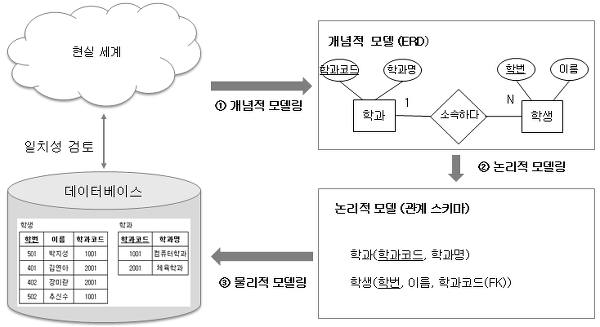
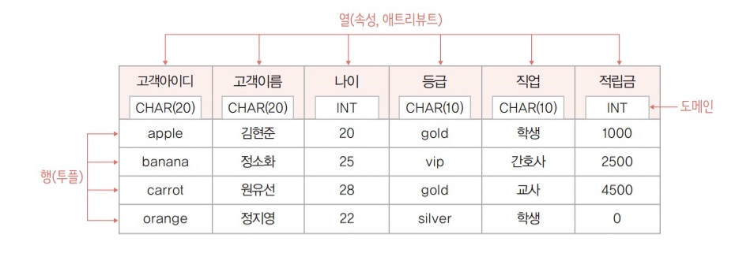
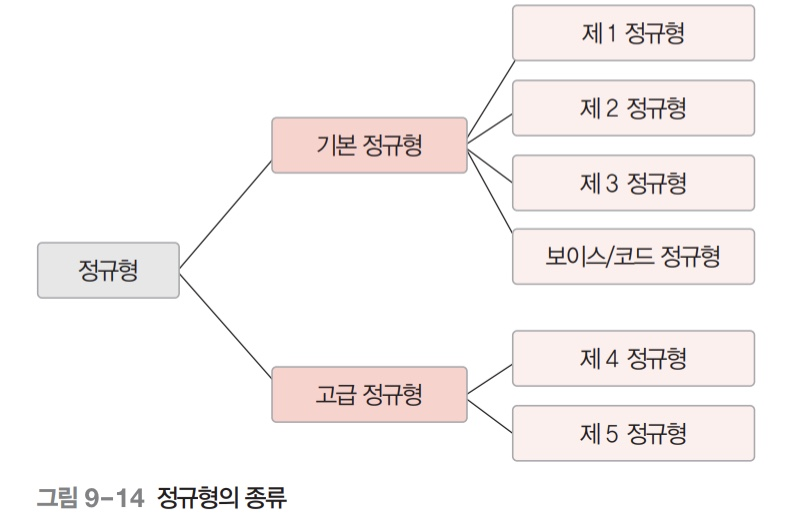

## ❤ 데이터베이스의 기본 개념

**데이터와 정보**

- 데이터 : 단순히 관찰하거나 측정하여 수집한 사실이나 값(자료)
- 정보 : 의사 결정에 유용하게 활용할 수 있도록 데이터를 처리해서 만든 유의미한 결과물
- 정보처리 : 데이터를 상황에 맞게 분석/해석하고, 데이터 간의 의미 관계를 파악하여 정보를 추출하는 과정이나 방법

**데이터베이스란?**

- 특정 조직의 여러 사용자가 **공유**해서 사용할 수 있도록 **통합**해서 **저장**한 **운영**데이터의 집합
- 공유데이터 : 여러 사용자가 함께 소유하고 사용할 수 있음
- 통합테이터 : 데이터의 중복을 최소화하고 통제가 가능한 중복만 허용
- 저장데이터 : 컴퓨터가 접근 할 수 있는 매체에 저장
- 운영데이터 : 조직의 주요 기능을 수행하기 위해 꼭 필요하며, 지속적으로 유지해야 하는 데이터

**데이터 베이스의 특징**

- 실시간 접근 : 사용자가 요구에 따라 실시간으로 응답 가능해야 함
- 계속 변화 : 데이터를 계속 삽입/삭제/수정하여 현실세계의 정확한 데이터를 유지
- 동시 공유 : 여러사용자가 동시에 서로다른/같은 데이터 사용하는 것을 지원
- 내용으로 참조 : 주소나 위치가 아닌 값으로 참조 가능(ex. 데이터 검색)

**데이터의 분류**

- 데이터는 형태에 따라 아래 세가지로 분류된다.
- 정형데이터
  - 미리 정해진 구조에 따라 저장된 데이터
  - ex) 엑셀의 스프레이 시트, RDBMS의 테이블
- 반정형데이터
  - 구조에 따라 저장된 데이터지만 정형 데이터와 달리 데이터 내용 안에 구조에 대한 설명이 존재
  - ex) HTML, XML, JSON 문서나 웹 로그, 센서데이터
- 비정형데이터
  - 정해진 구조 없이 저장된 데이터
  - 텍스트, 영상, 이미지, PDF

<br/>

## ❤ 데이터베이스 관리 시스템

**파일 시스템**

- 데이터를 파일로 관리하기 위해 파일의 생성/삭제/수정/검색 기능을 제공하는 시스템
- 동일한 파일을 응용 프로그램에 필요한 형식에 맞도록 별도 관리해야 함
- 데이터의 중복성과 데이터의 종속성 문제 발생
  - 데이터 중복성(redundancy) : 동일한 내용의 파일이 여러개 생김. 하나 수정시 모든파일에 반영
  - 데이터 종속성(dependency) : 데이터와 응용프로그램 간 의존성을 가짐

**데이터 베이스 관리 시스템(DBMS)**

- 파일 시스템의 데이터 중복/종속 문제를 해결하기 위해 제시된 소프트웨어
- DB의 생성/접근/삭제/수정을 관리하며 문제가 발생하지 않도록 함

**DBMS의 주요 기능**

- 정의 기능 : 데이터베이스의 구조를 정의/수정
- 조작 기능 : 데이터를 삽입/삭제/수정/검색
- 제어 기능 : 데이터를 항상 정확하고 안전하도록 유지. (회복/보안/동시접근)

**DBMS의 종류**

- RDBMS
  - 집합론의 관계라는 개념에서 아이디어를 가져온 행과 열을 가지는 관계형 데이터베이스
  - ex) `Oracle`, `MySQL`, `MSSQL`, `SQLite`, `MariaDB`
- NoSQL
  - SQL을 사용하지 않는 데이터베이스
  - ex) `MongoDB`, `Firebase`, `redis`

<br/>

## ❤ 데이터 모델링

**데이터 모델링(DB 설계)**



- 현실 세계의 데이터를 DB로 옮기는 과정. 즉 DB를 설계하는 것
- 데이터 모델링 = 개념적 모델링 + 논리적 모델링 + 물리적 모델링
- 개념적 모델링
  - 현실 세계에서 중요 데이터를 추출하여 개념 세계로 옮기는 작업
  - ex) 개체-관계 모델(E-R Model)
- 논리적 모델링
  - 개념적 모델링으로 표현된 데이터구조를 DB에 저장하는 구조로 표현하는 것
  - DBMS에 따라 표현 방법이 달라진다.
  - ex) 관계-데이터 모델(relational data model)
- 물리적 모델링
  - 논리적 모델링으로 표현된 데이터 구조를 실제 DB에 옮겨 테이블을 설계하는 과정

<br/>

## ❤ 개체-관계 모델

**개체-관계 모델**

- 현실세계의 개체와 개체간의 관계를 개체(Entity), 속성(Attribute), 관계(Relation)로 기술하는 데이터 모델
- 피터 첸 표기법을 사용하여 개체-관계 모델을 그림으로 표현한 것이 개체-관계 다이어그램(ERD)
- 요즘은 까마귀 발 표기법을 사용하여 개체-관계 다이어 그램을 그림

**개체(Entity)**

- 현실 세계에서 사람이나 사물과 같이 구별되는 모든 것
- 다른 개체와 구별과는 이름을 가지며 각 개체만의 고유한 속성을 하나 이상 가짐
- 개체를 구성하는 속성이 실제 값을 가짐으로 써 실체화 된 개체를 개체 인스턴스라 한다.
- ERD에서 네모로 표현. DB의 테이블이 엔티티로 표현된다.

**속성(Attribute)**

- 개체가 가지고 있는 고유 특성
- 여러가지 속성
  - 키 속성 : 다른 개체들과 중복되지 않는 고유한 값을 갖는 속성
  - 널 속성 : 널 값이 허용되는 속성
  - 복합 속성
    - 독립적인 속성이 모여서 만드는 속성
    - ex) 시, 분, 초 세개의 속성이 모여 시간의 속성을 만듬
  - 다중 값 속성
    - 하나의 속성이 여러개의 값을 가지는 속성
    - ex) 전공이 여러개 일 경우
  - 유도된 속성
    - 다른 속성 값에서 유도되어 결정되는 속성
    - ex) 총액, 평균 등
- ERD에서 원으로 표현. DB에서 테이블의 각 컬럼(필드)가 속성

**관계(Relation)**

- 개체간의 의미 있는 연관성
- 아래의 2가지 구조적 제약조건으로 표현
- 매핑 카디널리티
  - 관계를 맺는 두 엔티티가 몇개의 엔티티와 관련될 수 있는지 명시
  - 일대일, 일대다, 다대다로 표현 가능
- 참여 제약 조건
  - 관계를 맺는 두 엔티티가 읜존성을 가지는지 명시
  - 전체참여, 부분참여로 표현 가능
  - ex) 학생은 과목을 수강할 필요가 없지만 과목은 항상 수강생이 있어야 함
- ERD에서 마름모로 표현

<br/>

## ❤ **관계-데이터 모델**

**관계-데이터 모델**

- 하나의 개체에 대한 데이터를 릴레이션에 담아 표현하는 모델
- 5가지의 릴레이션 변환 규칙을 따른다.
- 릴레이션이라는 2차원의 테이블 구조로 표현한다.

**릴레이션**



- 하나의 개체에 대한 데이터를 저장하는 기본 단위
- 속성
  - 릴레이션의 각 열
  - 데이터의 특성을 설명
  - 필드라고도 하며 여러가지 타입을 가짐(타입은 DBMS마다 다름)
- 튜플
  - 릴레이션의 각 행
  - 한 개체에 대한 데이터
- 도메인 : 하나의 속성이 가질 수 있는 값의 집합
- 차수 : 하나의 릴레이션의 속성 개수
- 카더널리티 : 하나의 릴레이션의 튜플 개수
- 키
  - 릴레이션 내에서 튜플을 고유하게 식별하는 속성
  - 키의 종류 : 슈퍼키, 후보키, 기본키, 대체키, 외래키

**릴레이션의 특징**

- 튜플의 유일성 : 하나의 릴레이션에는 동일한 튜플이 존재할 수 없음
- 튜플의 무순서 : 하나의 릴레이션에서 튜플 간의 순서는 무의미
- 속성의 무순서 : 하나의 릴레이션에서 속성 간의 순서는 무의미
- 속성의 원자성 : 속성 값으로 원자 값만 사용할 수 있음

**관계 - 데이터 모델의 제약조건**

- 무결성이란 ?
  - 데이터에 결함이 없는 상태. 즉 데이터가 정확하고 유효하게 유지된 상태
  - 관계 데이터 모델에서 정의하는 두가지 기본 제약 사항은 데이터를 정확하고 유효하게 유지하는 무결성을 보장해야한다는 규칙임
- 개체 무결성 제약조건
  - 기본키를 구성하는 모든 속성은 널 값을 가질 수 없음
- 참조 무결성 제약조건
  - 외래키는 참조할 수 없는 값을 가질 수 없다는 규칙

<br/>

## ❤ 관계 데이터 연산

**관계 데이터 연산**

- 관계 데이터 모델에서 연산은 원하는 데이터를 얻기 위해 릴레이션에 필요한 처리요구를 하는 것
- 대표적으로 관계 대수와 관계 해석이 있음
- 데이터에 대한 처리 요구를 질의(query)라고 함

**관계 대수**

- 원하는 결과를 얻기 위해 데이터의 처리 과정을 순서대로 기술하는 언어. 즉 릴레이션을 처리하는 연산자의 집합
- 일반 집합 연산자 : 합집합, 교집합, 차집합, 카티션프로덕트
- 순수 관계 연산자 : 셀렉트, 프로젝트, 조인, 자연조인, 세타조인, 디비전
- 확장된 관계 대수 연산자 : 세미조인, 외부조인

**관계 해석**

- 원하는 데이터가 무엇인지 기술하는 비절차 언어로 프레디킷 해석에 기반
- 비 절차 언어이기 때문에 컴퓨터가 다루기 어려워 많이 사용되지 않지만 DB의 이론적인 배경과 논리 구조를 이해할 수 있음

<br/>

## ❤ 데이터 베이스 언어 SQL

**SQL이란?**

- 관계 데이터 베이스를 위한 표준 질의어. 비절차 언어
- 데이터 조작어, 데이터 정의어, 데이터 제어어로 분류됨
- 모든 SQL문은 `;`로 문장 끝을 표시하며 대소문자를 구분하지 않음

**데이터 정의어(DDL)**

- DB를 구축하기 위해 스키마를 정의하거나 기존 스키마를 수정/삭제하는 언어
- CREATE : 테이블 생성
  ```sql
  CREATE TABLE 테이블명
  (
  	컬럼명 데이터타입 [제약조건],
  	컬럼명 데이터타입 NOT NULL,
  	컬럼명 데이터타입 CHECK(조건식)
  	컬럼명 데이터타입 DEFAULT 값,
  )
  ```
- ALTER : 테이블 컬럼 추가, 컬럼 수정, 컬럼 삭제
  ```sql
  ALTER TABLE 테이블명 ADD 컬럼 데이터타입 [제약조건];
  ALTER TABLE 테이블명 MODIFY 컬럼 데이터타입 [제약조건];
  ALTER TABLE 테이블명 DROP 컬럼명;
  ```
- DROP : 테이블 삭제

  ```sql
  DROP TABLE 테이블명 [CASCADE| RESTRICT];

  CASCADE : 참조하는 테이블까지 연쇄적으로 제거하는 옵션
  RESTRICT : 다른테이블이 삭제할 테이블을 참조중이면 제거하지 않는 옵션
  ```

- TRUNCATE : 테이블 내의 데이터 삭제
  ```sql
  TRUNCATE TABLE 테이블명;
  ```
- VIEW
  ```sql
  CREATE VIEW 뷰이름 AS
  SELECT
  FROM
  WHERE
  ---
  CREATE OR REPLACE VIEW 뷰이름 AS
  SELECT
  FROM
  WHERE
  ---
  DROP VIEW 뷰이름;
  ```
- INDEX
  ```sql
  CREATE INDEX 인덱스명 ON 테이블명(컬럼명)
  ---
  ALTER INDEX 인덱스명 ON 테이블명
  ---
  DROP INDEX 인덱스명;
  ```

**데이터 조작어(DML)**

- 데이터를 검색/삽입/수정/삭제 등의 처리에 사용하는 언어
- SELECT : 데이터를 조회
  ```sql
  SELECT [DISTINCT] 속성명, 속성명,
  FROM 테이블이름
  WHERE 조건
  	(BETWEEN A AND B)
  	(LIKE 패턴)
  	(IS NULL)
  GROUP BY 속성명
  HAVING 그룹조건
  ORDER BY 속성 [ASC|DESC];
  * 서브쿼리 : 쿼리 안에 쿼리
  ```
  ```sql
  UNION : 중복이 제거됨
  UNION ALL : 중복을 허용
  INTERSECT : 공통적으로 존재하는 결과 반환
  MINUS : 첫쿼리에 있고 두번째 쿼리에 없는 결과 반환
  ```
- INSERT : 데이터를 삽입
  ```sql
  INSERT INTO 테이블명 (속성명)
  VALUES (데이터)
  ```
- UPDATE : 데이터를 수정
  ```sql
  UPDATE 테이블명
  SET 속성명 = 데이터
  WHERE 조건;
  ```
- DELETE : 데이터를 삭제
  ```sql
  DELETE FROM 테이블명
  WHERE 조건;
  ```

**데이터 제어어(DCL)**

- DB가 무결성/보안/회복/동시성을 보장하기 위해 내부적으로 필요한 규칙이나 기법을 정의하는데 사용되는 언어
- GRANT(권한 부여) / REVOKE(권한 회수)
  ```sql
  GRANT 권한 ON 테이블 TO 사용자
  REVOKE 권한 ON 테이블 FROM 사용자
  ```

**뷰**

- 다른 테이블을 기반으로 만든 가상 테이블
- 논리적으로만 존재하며 위의 쿼리문을 사용해서 뷰를 생성/삭제 할 수있다.

<br/>

## ❤ 정규화

**이상현상**

- DB를 잘못 설계할 경우 불필요한 중복이 발생하여 릴레이션에 대한 데이터의 삽입/삭제/수정 연산 시 발생하는 부작용
- 종류
  - 삽입이상 : 새 데이터를 삽입하기 위해 불필요한 데이터도 함께 삽입해야하는 문제
  - 갱신 이상 : 중복된 튜플 중 일부 튜플만 변경하여 데이터가 불일치하게 되는 모순
  - 삭제 이상 : 튜플 삭제 시 꼭 필요한 데이터까지 함께 삭제되는 데이터 손실

**함수 종속성**

- 하나의 릴레이션을 구성하는 속성들의 부분 집합을 X와 Y라 할 때, 어느 시점에서든 릴레이션 내의 모든 투플에서 하나의 X 값에 대한 Y 값이 항상 하나면 "X가 Y를 함수적으로 결정한다." 또는 "Y가 X에 함수적으로 종속되어 있다."라고 한다.
- 릴레이션에서 속성 값은 계속 변할 수 있기 때문에 속성자체가 가지고 있는 특성과 의미를 기반으로 판단해야 한다.

**정규화**

- 이상현상이 발생하지 않도록 함수 종속성을 이용하여 릴레이션을 연관있는 속성들로만 구성되도록 분해하는 과정
- 거창해보이지만 데이터베이스를 더 효율적으로 조작하기 위한 DB 설계 규칙을 의미함
- 일반적으로 제 3정규형까지만 만족시켜도 DB를 깔끔하게 유지할 수 있으며 과도한 정규화는 조인을 많이 필요로해 느려질 수 있어 비정규화를 다시 해줘야 할 수 있다. 따라서 서비스에 따라 적절히 정규화를 진행해야 함

**정규형**



- 릴레이션이 정규화 된 정도
- 제 1정규형
  - 모든 도메인이 더 이상 분해될 수 없는 원자 값으로만 구성되어야 함
- 제 2정규형
  - 릴레이션이 제 1정규형에 속하며, 기본키가 아닌 모든 속성이 기본키에 완전 함수 종속 이여야 함
  - 릴레이션의 분해시 동등한 릴레이션으로 분해해야 하고, 정보 손실이 발생하지 않는 무손실 분해여야 함
- 제 3정규형
  - 릴레이션이 제 2정규형에 속하며, 기본키가 아닌 모든 속성이 이행적 함수 종속을 만족하지 않는 상태여야 함
  - 릴레이션을 구성하는 3개의 속성 집합 X, Y, Z에 대해 함수 종속 관계 X -> Y와 Y -> Z가 존재하면 논리적으로 X -> Z가 성립한다. 이때 속성 집합 Z가 속성 집합 X에 이행적으로 함수 종속되었다고 함
- 보이스/코드 정규형
  - 제 3정규형이며, 모든 결정자가 후보키인 상태
- 제 4정규형
  - 릴레이션이 보이스/코드 정규형에 속하며, 함수 종속이 아닌 다치 종속을 제거해야 함
- 제5정규형
  - 릴레이션이 제4정규형에 속하며, 후보키를 통하지 않는 조인 종속을 제거해야 함

<br />

## ❤ 트랜잭션

**트랜잭션이란 ?**

- 하나의 논리적 기능을 정상적으로 수행하기 위한 작업의 기본 단위

**트랜잭션의 특성(ACID)**

- 트랜잭션이 성공적으로 처리되어 데이터베이스의 무결성과 일관성이 보장되려면 네 가지 특성을 꼭 만족해야 한다.
- 원자성(Atomicity) : 분해가 불가능한 작업의 최소단위. 즉 트랜잭션의 연산이 모두 성공하거나 모두 실패해야 함
- 일관성(Consistency) : 트랜잭션이 수행된 이후 항상 일관된 데이터베이스 상태를 보존
- 격리성(Isolation) : 트랜잭션 실행 중 연산의 중간 결과를 다른 트랜잭션이 접근 불가
- 지속성/영속성(Durability) : 성공 완료된 트랜잭션의 결과는 영속적으로 데이터베이스에 저장

**트랜잭션 제어언어 TCL**

- 커밋(COMMIT) : 트랜잭션을 메모리에 영구적으로 저장(작업 완료)
- 롤백(ROLLBACK) : 오류가 발생했을 때, 오류 이전의 특정 시점 상태로 되돌려주는 제어어(작업 취소)
- 체크포인트(CHECKPOINT) : 롤백을 위한 시점을 지정
