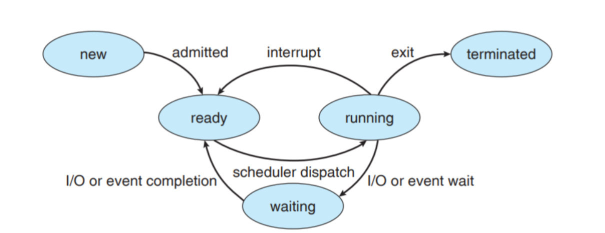
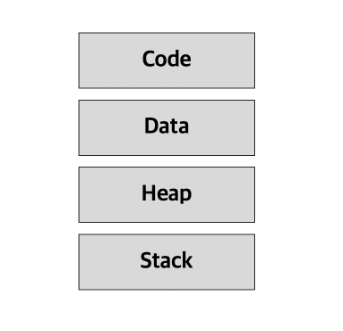

## ❤ 운영체제와 컴퓨터구조

### ✨ 운영체제

#### 🔹 운영체제의 정의

- 컴퓨터 하드웨어의 바로 위에 설치되어 사용자에게 편리한 인터페이스 환경을 제공하고 컴퓨터 시스템의 자원을 효율적으로 관리하는 소프트웨어

#### 🔹 운영체제의 구조

- **커널** : 프로세스 관리, 메모리 관리, 저장장치 관리와 같은 운영체제의 핵심적인 기능을 모아놓은것
  - **시스템콜** : 커널이 자신을 보호하기 위해 만든 인터페이스. 사용자가 응용 프로그램이 자원에 직접 접근하지 못하게 막음으로써 자원을 보호한다.
    - 동작원리 : 유저프로그램이 I/O 요청으로 트랩(trap)을 발동시키면 올바른 I/O 요청인지 확인한 후 유저모드가 시스템 콜을 통해 커널 모드로 변환되어 실행된다.
    - 시스템 호출이 동작할 때 modebit이라는것을 참고해서 유저모드와 커널 모드를 구분하며 커널모드일 때는 모든 컴퓨터 자원에 접근 가능하며 유저 모드일 때는 접근할 수 있는 영역을 제한한다.
    - ex) fork(), exec(), wait(), exit()
  - **드라이버** : 하드웨어의 특성을 반영한(제어하기 위한) 소프트웨어
    - 응용프로그램과 커널의 인터페이스가 시스템 호출이라면 커널과 하드웨어의 인터페이스를 드라이버라고 한다.
    - 하드웨어의 특성을 담은 소프트웨어인 드라이버를 설치하여 하드웨어를 제어할 수 있도록 한다.
- **인터페이스(GUI)** : 사용자 인터페이스로 사용자의 명령을 커널에 전달하고 실행결과를 알려줌

#### 🔹 **운영체제의 역할(목표)**

- **CPU 스케줄링과 프로세스 관리** : CPU 소유권을 어떤 프로세스에 할당할 지, 프로세스의 생성/삭제, 자원 할당/반환 관리
- **메모리 관리** : 한정된 메모리를 어떤 프로세스에 얼만큼 할당해야 하는지 관리
- **디스크 관리** : 디스크 파일을 어떠한 방법으로 보관할 지 관리
- **I/O 디바이스 관리** : I/O 장치간 데이터를 주고받는것을 관리

### ✨ 컴퓨터 구조

#### 🔹 **컴퓨터 성능 향상 기술**

- **캐시**
  - 두 장치간의 속도차에 따른 병목 현상을 줄이기 위한 범용 메모리로 RAM 보다 크기가 작음
  - 메모리의 **지역성**을 이용해 주 기억장치에서 자주 사용하는 프로그램과 데이터를 저장해두어 메모리 후속요청시 캐쉬에서 빠르게 참조하여 사용
  - **캐시 라인(Cahce Line)**
    캐시에 데이터를 저장할 때 set이나 map등의 특정 자료구조를 사용하여 데이터와 데이터 메모리 주소를 묶음으로 저장하는 것
  - **캐시 히트(Cache Hit)와 캐시 미스(Cache Miss)**
    CPU가 필요로 하는 데이터를 RAM으로 찾으러 가기전에 캐시에서 데이터의 존재여부를 확인하는데 이때 캐시메모리에 해당 데이터가 있는경우를 캐시 히트, 없는 경우를 캐시 미스라고 함
  - **캐시 매핑(Cache Mapping)**
    캐시는 RAM보다 용량이 작기 때문에 캐시 미스가 발생할 수 밖에 없는데 다음과 같은 캐시 메모리 사상기법을 통해 캐시 적중률을 높임
    **직접 매핑(Direct Mapping)** : RAM을 일정한 크기의 블록으로 나누어 각각의 블록을 캐시의 정해진 위치에 매핑
    **연관 매핑(Associate Mapping)** : 캐시 메모리의 빈 공간에 마음대로 주소를 저장하는 방식
    **집합 연관 매핑(Set Associate Mapping)** : 직접 매핑과 연관 매핑을 결합한 방식으로 빈 공간에 마음대로 주소를 저장하되, 미리 정해준 특정 행에만 저장하는 방법

## ❤ 프로세스와 스레드

### ✨ 프로세스

#### **🔹 프로세스의 정의**

- 프로그램(Program) : 저장장치에 저장되어 있는 정적인 상태로 파일 시스템의 실행 파일
- 프로세스(Process) : 메모리 상에서 실행중인 프로그램.
- 프로그램은 운영체제로부터 **프로세스 제어블록(PCB)**을 얻어 프로세스가 되며, 프로세스 제어 블록이 폐기 됨으로서 프로세스가 종료됨
- 프로세스는 각각 자신만의 고유 공간과 자원을 할당받아 사용. 각각의 영역을 갖기에 동기화 작업이 필요하지 않지만, 컨텍스트 스위칭 비용이 큼
- 운영체제 또한 프로그램이기 때문에 컴퓨터는 일반 사용자의 **사용자 프로세스(user process)** 와 운영체제의 **커널 프로세스(kernerl process)** 가 섞여서 실행됨
- 현대 운영체제는 컴퓨터 시스템의 물리적 CPU 수보다 많은 프로세스를 **‘동시’**에 처리할 수 있도록, 프로세스 각각이 온전히 사용할 수 있는 CPU를 하나씩 가지는 것처럼 **가상화**한다.
- 이는 각 작업 또는 사용자들에게 CPU를 한 번에 일정 시간만큼만 제공하여 공유하는 **시분할(Time-sharing)** 기법을 통해 달성 가능하다.

#### 🔹 프로세스의 상태

| 생성 New                       | 프로그램을 메모리에 가져와 실행 준비가 완료된 상태. 즉 프로세스가 생성된 상태                                                               |
| ------------------------------ | ------------------------------------------------------------------------------------------------------------------------------------------- |
| 준비 Ready                     | 실행을 기다리는 모든 프로세스가 자기 차례를 기다리는 상태. 실행될 프로세스는 CPU 스케줄러가 선택                                            |
| 실행 Running                   | CPU 소유권과 메모리를 할당받아 사용하는 상태. 프로세스 사이의 문맥 교환이 일어남                                                            |
| 대기 waiting 혹은 중단 Blocked | 어떤 이벤트(EX. 실행 상태에 있는 프로세스가 입출력 요청)가 발생한 이후 기다리는 상태. 입출력이 완료되면 준비 상태로 감                      |
| 완료 Terminated                | 프로세스가 종료되어 메모리와 CPU 소유권을 모두 놓고 가는 상태. 사용하던 모든 데이터가 정리됨. 정상 종료인 exit와 비정상 종료인 abort를 포함 |

#### 🔹 프로세스의 주소공간(메모리 구조)

- 프로세스가 실행 중에 접근할 수 있도록 허용된 주소의 최대범위로 데이터를 공유하여 메모리를 효율적으로 사용하기 위해 4가지 영역으로 나누어짐
- 코드영역과 데이터 영역은 프로세스가 실행되기 직전(컴파일단계)에 위치와 크기가 결정되므로 정적 할당영역이지만, 스택영역과 힙 영역은 프로세스가 실행되는 동안(런타임단계) 만들어지는 영역으로 동적 할당 영역임
- 스택과 힙영역은 같은 물리 메모리 공간을 공유하지만, 힙은 낮은주소부터 스택은 높은 주소부터 채워지기에 서로의 영역을 누가 침범하느냐에 따라 `heap overflow`, `stack overflow`가 발생
- **코드영역**
  프로그램의 본문이 기술된 영역으로 텍스트영역이라고도 함
- **데이터영역**
  코드가 실행되면서 사용하는 변수나 파일 등의 각종 데이터를 모아놓은 곳
- **힙영역**
  사용자에 의해 동적으로 메모리 공간을 할당하고 해제하는 영역. 메모리 주소값에 의해서 참조되고 사용됨
- **스택영역**
  함수가 호출될 때마다 함수 호출과 관련된 정보들이 저장되는 영역으로 변수의 스코프나 함수가 호출된 메모리 주소 등을 저장함.

#### 🔹 **프로세스 제어 블록(PCB, Process Control Block)**

- 프로세스를 실행하는데에 중요한 정보를 보관하는 자료구조
- 모든 프로세스는 고유의 프로세스 제어 블록을 가지며, 프로세스 제어 블록은 프로세스 생성 시 OS 커널에 의해 만들어지고, 프로세스가 실행을 완료하면 폐기됨.
- 프로세스의 중요한 정보를 담고 있기 때문에 일반 사용자가 접근하지 못하도록 커널스택의 가장 앞부분에서 관리되며 커널모드에서만 접근 가능하다.
- OS의 스케줄러에 의해 Context Switching 되는 프로세스의 정보 단위
- 아래의 정보들로 이루어져 있다.
  - **프로세스 ID(Process ID)** : 프로세스 ID, 해당 프로세스의 자식 프로세스 ID
  - **프로세스 스케줄링 상태(Process state)** : '준비', '일시중단' 등 프로세스가 CPU에 대한 소유권을 얻은 이후의 상태
  - **프로세스 우선순위(Process Priority)** : 프로세스의 실행 순서를 결정하는 우선순위
  - **프로세스 권한** : 컴퓨터 자원 또는 I/O 디바이스에 대한 권한 정보
  - **프로그램 카운터(Program Counter)** : 프로세스에서 실행해야 할 다음 명령어의 주소에 대한 포인터
  - **CPU 레지스터(CPU Register)** : 프로세스를 실행하기 위해 저장해야 할 레지스터에 대한 정보
  - **CPU 스케줄링 정보** : CPU 스케줄러에 의해 중단된 시간 등에 대한 정보
  - **계정 정보(Accounting Information)** : 프로세스 실행에 사용된 CPU 사용량, 실행한 유저의 정보
  - **I/O 상태 정보** : 프로세스에 할당된 I/O 디바이스 목록

### ✨ 스레드

#### 🔹 스레드의 정의

- 프로세스 내부의 작은 실행 단위. 하나의 프로세스는 여러 스레드를 가질 수 있음

#### 🔹 스레드 주소공간

- 스레드는 프로세스와 달리 프로세스의 `Code`, `Data`, `Heap` 영역을 공유하고 `Stack` 영역만 따로 할당 받음
- Stack영역만 따로 할당받는 이유는 코드를 실행하다 함수를 호출하면 스택에 그 리턴값, 되돌아갈 주소값 등을 쌓아둬야 하는데, 실행단위(스레드)가 여러개니까 스택도 별도로 둠
- 모든 스레드가 자원을 공유하기 때문에 하나의 스레드에 문제가 생기면 프로세스에 영향을 미침
- 한 프로세스 내에서 동작되는 실행의 흐름 이므로, 프로세스 내의 자원들을 공유하기 때문에 컨텍스트 스위치 비용이 적음
- 임계영역에 동시에 접근하는 경우 다른스레드가 사용중인 변수나 자료구조에 접근하여 엉뚱한 값을 읽어오기도 함 ⇒ 동기화(뮤택스, 세마포어) 필요

#### **🔹스레드 제어 블록(TCB, Thread Control Block)**

- 프로세스에 있는 스레드 라이브러리에 의해 Context Switching 되는 스레드의 정보 단위

### ✨ 멀티프로세스 및 멀티스레드

#### **🔹멀티 프로세스**

- 여러 개의 독립적인 프로세스를 동시에 실행하는 것

#### **🔹멀티 스레드**

- 단일 프로세스의 컨텍스트 내에서 여러 스레드를 동시에 실행하는것
- 멀티 스레드 모델 : 멀티스레드를 구현하는 방법
  - **사용자 레벨 스레드** : 사용자 레벨에서 관련 라이브러리를 사용하여 구현하며, 라이브러리는 커널이 지원하는 스케줄링이나 동기화 같은 기능을 대신 구현해줌. 사용자 스레드가 커널 스레드를 사용하려면, 시스템 호출로 커널 기능을 이용해야함
  - **커널 레벨 스레드** : 커널이 멀티 스레드를 지원하는 방식
  - **멀티 레벨 스레드** : 사용자 레벨 스레드와 커널 레벨 스레드를 혼합한 방식으로 하이브리드 스레드라고도 함

### ✨ 프로세스 간 통신

#### 🔹 **프로세스 간 통신(Inter-Process Communication, IPC)**

- 프로세스가 다른 프로세스와 동시에 데이터를 주고받는 것
- **메세지를 전달하는 방법**
  `message passing` : 커널을 통해 메세지 전달, 파이프, 메세지큐, 소켓가 있음
- **주소공간을 공유하는 방법**
  `shared memory` : 서로 다른 프로세스간에도 일부 주소공간을 공유하게 하는 shared memory 매커니즘이 있음

#### 🔹 문맥 교환(Context Switching)

- CPU를 차지하던 프로세스가 나가고 새로운 프로세스를 받아들이는 작업으로 **두 프로세스의 프로세스 제어 블록을 교환**하는 작업
- 하나의 프로세스에 할당된 시간이 끝나거나, 인터럽트에 의해 발생
- 비용 : 캐시미스
- 문맥 교환은 스레드에서도 발생한다.

#### 🔹 인터럽트

- CPU가 입출력 관계자에게 입출력 명령을 보낸 후, 입출력 관리자는 명령받은 데이터를 메모리에 가져다 놓거나, 메모리에 있는 데이터를 저장장치로 옮기는데 이러한 처리가 완료되고 **입출력 관리자가 CPU에게 보내는 신호**
- **인터럽트 벡터**
  여러 개의 인터럽트를 하나의 배열로 만든 것으로 ISR(Interrupt Service Routine)의 주소를 보관
- **직접 메모리 접근(Direct Memory Access, DMA) :** CPU의 허락없이 메모리에 접근할수 있는 권한
- **메모리 매핑 입출력** : 직접 메모리 접근을 사용했을때의 복잡성을 해결하기 위한 방법으로, CPU가 사용하는 메모리 공간과, 입출력 작업 영역을 분리하여 메모리의 공간을 나누는 방법
- **사이클 훔치기** : CPU와 입출력 장치가 동시에 메모리에 접근할때 CPU가 사용 권한을 양보하는것

#### 🔹 **Blocking vs Non-Bloking**

- **Blocking :** 호출된 함수가 자신의 작업을 모두 끝날 때 까지 제어권을 갖고 있어 호출한 함수가 대기하도록 함
- **Non-Bloking :** 호출된 함수가 바로 return해서 호출한 함수에게 제어권을 주어 다른 일을 할 수 있게 함

#### 🔹 Synchronous vs Asynchronous

- **동기(Synchronous) :** 메소드를 실행하는 동시에 반환값이 기대되는 경우
- **비동기(Asynchronous) :** 메소드를 실행하는 동시에 반환값이 기대되는 경우가 아닌경우

#### 🔹 **Concurrency** vs **Parallelism**

- **동시성(Concurrency)**
  - 동시에 실행되는 것 같이 보이는 것
  - 싱글 코어에서 멀티 스레드를 동작 시키는 방식
  - 하나의 프로그램을 이루는 서로 다른 부분이 순서를 지키지 않고 실행되어도 결과에 영향을 미치지 않는 것을 의미한다
- **병렬성(Parallelism)**
  - 실제로 동시에 여러 작업이 처리되는 것
  - 멀티 코어에서 멀티 스레드를 동작 시키는 방식

## ❤ 공유자원/임계구역/교착상태

### ✨ 공유자원

#### 🔹 공유자원

- 여러 프로세스/스레드가 함께 접근할 수 있는 변수, 메모리, 파일, 데이터 등의 자원

#### 🔹 경쟁조건(Race Condition)

- 공유 자원에 대해 여러 개의 프로세스가 동시에 접근을 시도할 때 접근의 타이밍이나 순서 등이 결과값에 영향을 줄 수 있는 상태

### ✨ **임계 구역**

#### 🔹 **임계 구역(Critical Section)**

- 2개 이상의 프로세스/스레드가 공유 자원에 접근해서 실행 결과가 달라지게 될 수 있는 코드영역

#### 🔹 **임계 구역 해결 충족조건**

임계 구역 문제를 해결하려면 어떤 방법을 사용하든 아래 세가지 조건을 충족해야함

- **상호 배제(mutual exclusion)**
  한 프로세스가 임계구역에 들어가면 다른 프로세스는 임계구역에 들어갈 수 없음
- **한정 대기(bounded waiting)**
  어떤 프로세스도 무한 대기(infinite postpone)하지 않아야 함. 즉 특정 프로세스가 영원히 임계영역에 들어가지 못하면 안됨
- **진행의 융통성(progress flexibility)**
  한 프로세스가 다른 프로세스의 진행을 방해해서는 안됨

#### 🔹 **임계 구역 해결 방법(동기화방법)**

- **피터슨 알고리즘/데커 알고리즘**
  임계구역 해결 조건을 모두 만족하는 소프트웨어적 해결 방법
- **뮤택스(Mutex) === Lock**
  - 두 프로세스가 임계구역에 동시에 접근하지 못하도록 프로세스/스레드가 공유자원을 Lock을 통해 잠금 설정하고 Unlock을 통해 잠금 해제하는 객체(상태가 0과 1뿐이다)
  - Key객체를 기반으로 하며, 이 객체를 소유해야만 공유자원에 접근이 가능함.
- **세마포어(Semaphores)**
  - Semaphore(n)라는 정수 변수를 사용해 사용 가능한 자원의 수를 저장하는 추상 자료형
  - P연산을 사용해 자원을 점유(lock)하고 세마포어 변수(자원의 수) 감소
  - V연산을 사용해 잠금해제와 동기화를 수행. 세마포어 변수(자원의 수)증가
- **모니터(Monitor)**
  - 세마포어 알고리즘을 자동으로 처리하도록 설계한 코드
  - 보호할 자원을 임계구역으로 숨기고, 임계구역에서 작업할 수 있는 인터페이스(모니터)를 통해서만 자원에 접근할 수 있게 하여 공유자원을 보호함

### ✨ 교착 상태(Deadlock)

#### 🔹 교착상태 정의

- 2개 이상의 프로세스가 다른 프로세스의 작업이 끝나기만 기다리며 작업을 더 이상 진행하지 못하는 상태
- **자원할당 그래프** : 프로세스가 어떤 자원을 사용중이고, 어떤 자원을 기다리고 있는지를 방향성이 있는 그래프로 표현한 것

#### 🔹 **교착 상태의 원인(필요조건)**

- 아래 네가지 조건을 모두 충족해야 하고, 이중 단 하나라도 충족하지 않으면 발생하지 않음
- **점유와 대기(Hold and wait)**
  자원을 가진 프로세스가 다른 자원을 기다릴때 보유자원을 놓지 않고 계속 가지고있음
- **원형 대기(Circular wait)**
  점유와 대기를 하는 프로세스 간에 사이클이 형성되어야함
- **비선점(No preemption)**
  한 프로세스가 사용 중인 자원은 다른 프로세스가 강제로 뺏어올 수 없는 비선점 자원이어야 함
- **상호 배제(Mutual Exclusion)**
  한 프로세스가 자원을 독점하고 있으며 다른 프로세스는 접근이 불가능함 즉 매순간 하나의 프로세스만이 자원을 사용할 수 있음

#### 🔹 **교착 상태** 해결 방법

- **교착 상태 예방(Deadlock Prevention)**
  교착 상태를 유발하는 4가지 필요조건이 발생하지 않도록 무력화 하는것
  - Hold and Wait : 프로세스가 자원을 요청할때 다른 어떤 자원도 가지고있지 않아야한다
  - Circular Wait : 모든 자원 유형에 할당 순서를 정하여 정해진 순서대로만 자원 할당
  - No Preemption : 프로세스가 어떤 자원을 기다려야 하는 경우 이미 보유한 자원이 선점됨
  - Mutual Exclusion : 공유해서는 안되는 자원의 경우 반드시 성립해야함
- **교착 상태 회피(Deadlock Avoidence)**
  할당되는 자원의 수를 조절하여 교착 상태를 회피함
  - **은행원 알고리즘 :** 프로세스 시작시 해당 프로세스가 평생에 쓸 자원의 최대량을 알고 있다고 가정하고 총 자원의 양과 현재 할당한 자원의 양을 기준으로 안정/불안정 상태를 나누어 시스템이 안정 상태를 유지하도록 자원을 할당하는 알고리즘
- **교착 상태 검출(Deadlock Detection)**
  - **타임아웃을 이용한 교착상태 검출**
    일정 시간동안 작업이 진행되지 않은 프로세스를 교착상태가 발생한 것으로 간주하여 처리
  - **자원 할당 그래프를 이용한 교착 상태 검출**
    자원 할당 그래프를 모니터링 하면서 교착 상태가 발생했는지 확인
- **교착 상태 회복(Deadlock Recovery)**
  - 교착 상태가 검출되면 교착 상태를 유발한 프로세스를 강제로 종료
  - 교착 상태를 유발한 프로세스들로부터 자원을 뺏는 방법
- **교착 상태 무시(Deadlock Ignorance)**
  데드락이 일어나지 않는다 생각하고 아무런 조치도 취하지 않음

## ❤ CPU 스케줄링

### ✨ CPU 스케줄링

#### 🔹 **CPU 스케줄링 정의**

- **CPU 스케줄링** : 어떤 프로그램에게 CPU 소유권을 줄 지 결정하는 알고리즘
- **CPU 스케줄러** : CPU 스케줄링을 수행하는 운영체제의 구성 요소
- CPU 스케줄러는 CPU 이용률이 높도록, 주어진시간에 많은 일을 할 수 있도록 스케줄링을 수행한다.

#### 🔹 **스케줄링의 단계**

- **고수준 스케줄링(장기 스케줄링)**
  시스템 내의 프로세스 수(멀티프로그래밍 정도)를 조절
- **중간수준 스케줄링(중기 스케줄링)**
  전체 시스템의 활성화된 프로세스 수를 조절하여 과부하를 막는 것
- **저수준 스케줄링(단기 스케줄링)**
  어떤 프로세스에 CPU를 할당할지, 어떤 프로세스를 대기상태로 보낼지 등을 결정하는 것

### ✨ 스케줄링 알고리즘 종류

#### 🔹 비선점형 알고리즘

CPU가 한 번 프로세스에 할당되면, 그 프로세스가 CPU 사용을 끝낼 때까지 다른 프로세스로 바뀌지 않는 알고리즘. 컨텍스트 스위칭으로 인한 부하가 적다.

- **FCFS 스케줄링(First Come First Service), 선입선출 스케줄링**
  - 준비 큐에 도착한 순서대로 CPU를 할당하는 비선점형 방식
  - 단점 : CPU를 오래 쓰는 프로세스가 먼저 도착하면 짧은 프로세스들이 다 기다려줘야 하므로 비효율적
- **SJF 스케줄링(Shortest Job First), 최단 작업 우선 스케줄링**
  - 준비 큐에 있는 프로세스 중 실행 시간이 가장 짧은 작업부터 CPU를 할당하는 비선점형 방식
  - 단점 : CPU 시간이 긴 서비스는 영원히 CPU를 못받을수도 있으며, CPU 사용시간을 미리 알 수없음
- **HRN 스케줄링(Highest Response Ratio Next), 최고 응답률 우선 스케줄링**
  - CPU를 할당 받기 위해 기다린 시간(대기 시간)과 CPU 사용 시간(서비스 시간)을 고려하여 프로세스의 응답 비율을 계산하여 응답 비율이 가장 높은 프로세스에게 CPU를 할당하는 방식

#### 🔹 선점형 알고리즘

CPU가 한 프로세스에 할당 되더라도 특정 조건이 충족되면 운영체제가 강제로 CPU를 회수하여 다른 프로세스에 할당하는 알고리즘으로 현대 운영체제가 채택한 방식

- **라운드 로빈 스케줄링(Round Robin, RR), 순환 순서 방식**
  - 한 프로세스가 할당받은 시간(time quantum) 동안 작업을 하다가 작업을 완료하지 못하면 준비 큐의 맨 뒤로 가서 자기 차례를 기다리는 방식
  - 단점 : 퀀텀타임이 크면 FCFS, 너무 작으면 오버헤드 발생
- **SRTF 스케줄링(Shortest Remaining Time First), 최소 잔류 시간 우선 스케줄링**
  - 현재 수행중인 프로세스보다 더 짧은 작업이 준비큐에 들어오면 수행하던 프로세스를 중지하고 해당 프로세스를 수행하는 선점형 방식
  - 라운드 로빈 스케줄링 기반으로 CPU를 할당받을 프로세스를 선택할 때 남아 있는 작업 시간이 가장 적은 프로세스를 선택하는 선점형 방식
  - 단점 : 프로세스의 종료시간을 예측하기 어려우며, Starvation 발생
  - _궁금증) 라운드 로빈 스케줄링 기반이 맞는지 ?_
- **다단계 큐 스케줄링(Multilevel Queue)**
  - 스케줄링의 우선순위에 따라 준비 큐를 여러개 사용해 큐마다 다른 스케줄링 알고리즘을 적용하는 비선점형 방식
  - 단점 : 우선순위를 이용해 공평성에 위배되며 큐 간의 프로세스 이동이 안되므로 유연성이 떨어짐
  - 해결법 : 다단계 피드백 큐 스케줄링
- **다단계 피드백 큐 스케줄링(Multilevel Feedback Queue)**
  - 다단계 큐 스케줄링의 문제점을 보완한 방식으로 기본적 형태가 동일하지만, CPU를 사용하고 난 프로세스가 원래 큐로 돌아가지 않고 우선순위가 하나 낮은 큐의 끝으로 삽입
  - 오늘날의 운영체제가 CPU 스케줄링을 위해 일반적으로 사용하는 방식

#### 🔹 둘 다 허용되는 알고리즘

- **우선순위 스케줄링(Priority Scheduling)**
  - 프로세스의 중요도에 따라 우선순위를 반영하여 CPU를 할당하는 방식으로 선점형, 비선점형 둘다 구현 가능
  - 단점 : 우선순위 낮은애들은 영원히 CPU를 받지 못함(Starvation)
  - 해결법 : 우선순위가 낮아도 오래되면 우선순위를 높여줌(Aging)
  - **고정 우선순위 방식** : 운영체제가 프로세스에 우선순위를 부여하면 프로세스가 끝날때까지 바뀌지 않는 방식으로 구현하기 쉽지만 유연하지 못해 효율이 좋지 않음
  - **변동 우선순위 방식** : 프로젝트 생성 시 부여받은 우선순위가 프로세스 작업 중간에 변하는 방식으로 구현하기 어렵지만 효율성이 좋음

## ❤ 메모리 관리

### ✨ 물리 메모리

#### 🔹 메모리 관리 배경

- 과거 일괄처리 시스템에서는 한 번에 한 가지 작업만 처리했기 때문에 메모리 관리가 어렵지 않았으나, 현재의 시분할 시스템에서는 운영체제를 포함한 모든 응용 프로그램이 메모리에 올라와 실행되기 때문에 메모리 관리가 복잡함
- 따라서 복잡한 메모리 관리를 위해 운영체제의 **메모리 관리 시스템(**Memory Management System, MMS)이 프로그램을 메모리에 올린다.

#### 🔹 메모리 관리자의 역할

- **가져오기(fetch)** 프로세스와 데이터를 메모리로 가져오는 작업
- **배치(placement)** 가져온 프로세스와 데이터를 메모리의 어느 부분에 올려놓을지 결정하는 작업
- **재배치(replacement)** 꽉 차있는 메모리에 새로운 프로세스를 가져오기 위해 오래된 프로세스를 내보내는 작업

#### 🔹 메모리 관리 정책

- **가져오기 정책(fetch policy)** 프로세스가 필요로 하는 데이터를 언제 메모리로 가져올지 결정하는 정책
- **배치 정책(placement policy)** 가져온 프로세스를 메모리의 어떤 위치에 올려놓을지 결정하는 정책
- **재배치 정책(replace policy)** 메모리가 꽉 찼을 때 메모리 내에 있는 어떤 프로세스를 내보낼지 결정하는 정책

#### 🔹 메모리 주소

- **주소 바인딩** : 주소를 결정하는것
- **물리 주소 공간** : 하드웨어에서 바라본 주소 공간으로 컴퓨터 마다 그 크기가 다름
- **논리 주소 공간** : 사용자 입장에서 바라본 주소 공간
- **절대 주소** : 실제 물리 주소를 가리키며 메모리 관리자 입장에서 바라본 주소
- **상대 주소** : 사용자 영역이 시작되는 주소를 0번지로 변경하여 사용하는 주소

#### 🔹 메모리 분할 방식

메모리를 어떤 크기로 나눌 것 정하는 방법. 가변 분할 방식과 고정 분할 방식이 있다.

- **가변 분할 방식(세그먼테이션 기법)**
  - 프로세스 크기에 따라 메로리를 나누는 방식으로 메모리의 영역이 다름
  - 한 프로세스가 연속된 공간에 배치되는 연속 메모리 할당임
  - 프로세스 크기 < 분할 크기 → 내부조각 발생하지 않지만 외부조각 발생 → 외부 단편화
  - **외부 단편화를 해결하기 위한 메모리 배치 방식**
    - **최초 배치** : 메모리에서 적재 가능한 공간을 순서대로 찾다가 첫번 째로 발견한 공간에 프로세스를 배치하는 기법
    - **최적 배치** : 메모리의 빈 공간을 모두 확인한 후 적당한 크기 가운데 가장 작은 공간에 프로세스를 배치하는 기법
    - **최악 배치** : 최적 배치와 정반대로 빈 공간을 모두 확인한 후 가장 큰 공간에 프로세스를 배치하는 기법
  - 메모리 관리가 복잡
- **고정 분할 방식(페이징 기법)**
  - 프로세스 크기와 상관없이 메모리를 같은 크기로 나누는 방식
  - 하나의 프로세스가 분산되어 배치되는 비연속 메모리 할당
  - **내부 단편화** : 메모리 조각에 프로세스를 배치하고 공간이 남는 현상
- 정리 ><
  | 구분 | 고정 분할 방식 | 가변 분할 방식 |
  | ----------- | -------------------------- | -------------------------------- |
  | 메모리 단위 | 페이징 | 세그먼테이션 |
  | 특징 | 비연속 메모리 할당 | 연속 메모리 할당 |
  | 장점 | 메모리 관리가 편리 | 프로세스를 한 덩어리로 관리 가능 |
  | 단점 | 프로세스가 분할되어 처리됨 | 빈 공간의 관리가 어려움 |
  | 단편화 | 내부 단편화 | 외부 단편화 |

### ✨ 가상 메모리 기초

#### 🔹 가상 메모리의 개념

- 물리 메모리 크기의 한계를 극복하기 위해 나온 기술로, 물리 메모리의 크기와 상관없이 프로세스에 커다란 메모리 공간을 제공하는 것처럼 보이게하는 기술.
- 크기가 다른 다양한 물리 메모리에서 일관되도록 프로세스를 실행할 수 있는 기술.
- 따라서 프로세스는 운영체제의 위치나 물리 메모리의 크기를 신경쓰지 않고 메모리를 사용할수 있음
- 가상 메모리 시스템은 물리 메모리와 별개로 자신이 어느 위치에 있는지와 상관 없이 0번지부터 시작하는연속된 메모리 공간을 갖는다.
- **매핑 테이블(mapping table)** : 가상 주소가 물리 메모리의 어느 위치에 있는지 알 수 있도록 정리한 표

#### 🔹 가상 메모리의 메모리 분할 방식

- **페이징(Paging)**
  - 고정 분할 방식을 이용한 가상 메모리 관리 기법. 프로세스의 가상 메모리를 동일한 사이즈의 페이지 단위로 나누어 관리하는 기법
  - **특징**
    - **페이지** : 가상 주소의 분할된 각 영역
    - **프레임** : 물리 주소의 분할된 각 영역
    - **페이지 테이블** : 모든 페이지의 위치 정보가 담겨있는 매핑 테이블
    - **페이징 기법 주소 변환** : VA = <P, D> → PA = <F, D>
  - **페이지 테이블 매핑 방식**
    - 프로세스는 각각의 페이지 테이블을 가지는데, 이는 물리 메모리 영역의 운영체제 영역 모아둠. 전체 테이블의 크기는 프로세스 수에 비례하며 크기가 작지 않아 관리가 어려움. 따라서 페이지 테이블의 크기를 적정하게 유지하는 것이 페이지 테이블 관리의 핵심
    - **직접 매핑** : 페이지 테이블 전체가 물리 메모리의 운영체제 영역에 존재하는 방식
    - **연관 매핑** : 페이지 테이블 전체를 스왑 영역에서 관리하는 방식으로 물리 메모리가 작을때 사용
    - **집합-연관 매핑** : 연관 매핑의 문제를 개선한 방식으로, 페이지 테이블을 일정한 집합으로 자르고 자른 덩어리 단위로 물리 메모리에 가져오는 방식
    - **역매핑** : 위의 세 가지 매핑과 달리 물리 메모리의 프레임 번호를 기준으로 테이블을 구성
- **세그먼테이션(Segementaion)**
  - 가변 분할 방식을 이용한 가상 메모리 관리 기법.. 프로세스의 가상 메모리를 의미 단위인 세그먼트에 따라 가변적으로 나누어서 사용
  - **특징**
    - **세그먼테이션 매핑 테이블** : 모든 세그먼트의 위치 정보가 담겨있는 매핑 테이블
    - **limit** : 세그먼트의 크기
    - **address** : 물리 메모리상 시작 주소
    - **세그먼테이션 기법 주소 변환** : VA = <S, D> → PA = <F, D>
- **세그먼테이션-페이징 혼용 기법**
  - 세그먼테이션과 페이징이 혼합된 형태로 세그먼트 하나가 여러개의 페이지로 구성되어있는 가상 메모리 관리 기법
  - 메모리 보호 및 중복 정보를 세그먼테이션 테이블에서 관리 함으로써 메모리 관리에 효율적

### ✨ 가상 메모리 관리

#### 🔹 요구 페이징

- CPU가 요청할때 프로세스의 페이지를 메모리에 가져오는 것.

#### 🔹 페이지 부재(Page fault)

- 프로세스가 페이지를 요청했을때 그 페이지가 메모리에 없는 상황
- 페이지 부재 발생 시 커널모드로 들어가서 페이지 부재 핸들러가 호출되고, 스왑영역에 있는 페이지를 메모리의 빈 영역에 올리고 페이지 테이블 갱신

#### 🔹 지역성(Locality)

- 기억장치내의 정보를 균일하게 Access하는것이 아닌 어느 한 순간에 특정 부분을 집중적으로 참조하는 성질이 있다는 이론
- **공간의 지역성(spatial locality)** : 현재 위치에서 가까운 데이터에 접근할 확률이 먼 거리에 있는 데이터에 접근할 확률보다 높음
- **시간의 지역성(temporal locality)** : 현재를 기준으로 가장 가까운 시간에 접근한 데이터가 더 먼 시간에 접근한 데이터보다 사용될 확률이 높음
- **순차적 지역성(sequential locality)** : 여러 작업이 순서대로 진행되는 경향이 있음

#### 🔹 페이지 교체 알고리즘

- 페이지 부재 발생시 물리 메모리가 모두 사용중이라면 페이지 교체가 이루어 져야 하는데, 어떤 페이지를 스왑영역으로 보낼지 결정하는 것
- **무작위 페이지 교체 알고리즘(Random Page Replacement Algorithm)**
  - 스왑 영역으로 쫓아낼 대상 페이지를 특별한 로직 없이 무작위로 선정
  - 단점 : 지역성을 고려하지 않아 알고리즘의 성능이 좋지 않음
- **FIFO 페이지 교체 알고리즘(First In First Out)**
  - 메모리에 가장 먼저 들어온 페이지를 대상 페이지로 선정
  - 단점 : 무조건 오래된 페이지를 대상페이지로 선정하기 때문에 성능이 좋지 않음
- **최적 페이지 교체 알고리즘(Optimal Page Replacement Algorithm)**
  - 앞으로 사용하지 않을 페이지를 스왑영역으로 이동시키는 알고리즘
  - 단점 : 성능이 좋지만 실제 시스템에선 구현이 불가능
- **LRU 페이지 교체 알고리즘(Least Recently Used Page Replacement Algorithm)**
  - 메모리에 올라온 후 가장 오랫동안 사용되지 않은 페이지를 스왑영역으로 이동시키는 알고리즘
  - 페이지 접근 시간, 카운터, 참조 비트 시프트 방식으로 구현됨
  - 단점 : 메모리에 올라와 있는 페이지는 곧바로 주소 변환 되므로, 페이지 부재가 발생할 때만 OS로 제어권이 넘어감 따라서 페이지 참조 횟수를 알수 없으므로 페이징 시스템에서 사용 불가
- **LFU 페이지 교체 알고리즘(Least Frequency Used Page Replacement Algorithm)**
  - 페이지마다 그동한 사용된 횟수를 세어 횟수가 가장 적은 페이지를 스왑 영역으로 옮기는 알고리즘
  - 단점 : 페이지 접근 횟수를 표시하는 추가 공간 낭비, 페이징 시스템 사용 불가
- **NUR 페이지 교체 알고리즘(Not User Recently Page Replacement Algorithm)**
  - 참조 비트와 변경 비트 2비트를 사용하여 미래를 추정하여 페이지를 교체하는 알고리즘
- **MFU 페이지 교체 알고리즘(Most Frequently Used Page Replacement Algorithm)**
  - 참조횟수가 가장 작은 페이지가 최근에 올라오면 앞으로 계속 사용될것이라고 가정
- **2차 기회 페이지 교체 알고리즘(Second Chance Page Replacement Algorithm)**
  - FIFO알고리즘을 개선한 것으로 특정 페이지에 접근하여 페이지 부재 없이 성공할 경우 해당 페이지를 큐의 맨 뒤로 이동하여 대상 페이지에서 제외
  - 단점 : 큐를 유지하는 비용이 높고, 페이지가 성공하면 큐의 중간에 있는 값을 뒤로 이동해야 함
- **시계 알고리즘(Clock Algorithm)**
  - FIFO알고리즘을 개선한 것으로 2차 기회 페이지 교체 알고리즘과 유사하지만 원형큐를 사용하여 포인터를 이용하는 알고리즘
  - 단점 : 알고리즘이 복잡하고 계산량이 많음

### ✨ 스레싱과 프레임 할당

#### 🔹 스레싱(Threshing)

- 프로세스의 원활한 수행에 요한 최소한의 page frame수를 할당받지 못해 페이지 부재로 작업이 멈춘것 같은 상태
- 동시에 실행하는 프로그램 수(멀티프로그래밍 정도)가 높으면 스레싱이 발생
- 메모리 크기 뿐만아니라, 프레임을 얼마나 자주 나누어주느냐에 따라 스레싱 발생
- 스레싱을 예방하기 위해 정적할당과 동작할당 두가지 방식으로 프로세스에 프레임을 할당

#### 🔹 프레임 할당(Frame Allocation)

- **정적 할당(static allocation)**
  프로세스 실행 초기에 프레임을 나누어 준 후 그 크기를 고정하는 방식
  - **균등 할당 방식(equal allocation)**
    프로세스 크기와 상관없이 사용 가능한 프레임을 모든 프로세스에 동일하게 할당
  - **비례 할당 방식(proportional allocation)**
    프로세스 크기에 비례하여 프레임을 할당
    단점 : 프로세스가 실행중에 필요로 하는 프레임을 유동적으로 반영하지 못하며 사용하지 않을 메모리도 처음부터 미리 확보하여 공간을 낭비
- **동적 할당(dynamic allocation)**
  프로세스를 실행하는 중에 프레임을 나누어주기도 하고 회수하기도 하는 방식
  - **작업집합 모델(working set model)**
    최근 일정 시간동안 참조된 페이지들을 집합으로 만들고 이 집합에 있는 페이지들을 물리 메모리에 유지하여 페이지 부재 및 페이지 교체 현상을 줄여 프로세스의 실행을 도움

#### 🔹 PFF(Page-Fault Frequency) 알고리즘

페이지 부재 빈도 알고리즘은 프로세스의 페이지 부재율을 주기적으로 조사하고 이 값에 근거해서 각 프로세스에 할당할 메모리 양을 동적으로 조절

## ❤ 파일 시스템

#### 🔹 파일 시스템

- **파일(File)**
  파일은 논리적 저장단위로, 관련된 자료들의 집합에 이름을 붙인 것
- **파일 시스템(File System)**
  컴퓨터에서 파일이나 자료를 쉽게 발견 및 접근할 수 있도록 보관 또는 조직하는 체제로 파일 및 파일의 메타데이터, 디렉터리 정보 관리
- **파티션(Partition)**
  연속된 저장공간을 하나 이상의 연속되고 독립적인 영역으로 나누어 사용할 수 있도록 정의한 규약
- **파일 디스크립터(File Descriptor)**
  사용자가 특정 파일에 접근시 파일에 접근할 수 있는 권한

#### 🔹 파일 접근 방법(Access Methods)

- 파일은 하나의 데이터 덩어리로 접근 방법에 따라 순차 접근, 직접 접근, 인덱스 접근으로 나뉘어짐
- **순차 접근(Sequential Access) :** 가장 단순한 방법으로 파일의 정보가 레코드 순서대로 처리
- **직접 접근(Random Access) :** 저장하려는 데이터의 특정 값에 어떤 관계를 정의하여 물리적인 주소로 변환
- **인덱스 접근(Index Access) :** 인덱스 테이블을 추가하여 해당 인덱스를 찾아 대응되는 포인터로 접근

#### 🔹 디스크의 파일데이터 할당

- **연속 할당(Contiguous Allocation)**
  파일을 구성하는 데이터를 디스크상에 연속적으로 배열하는 간단한 방식이지만 실제로 사용되지 않음
  한번의 탐색으로 많은양을 전송할 수 있으며 직접 접근 가능하지만 외부 단편화 발생, 내부 단편화가 발생할 수 있어 파일의 크기 수정이 어려움
- **불연속 할당** : 비어 있는 블록에 데이터를 분산하여 저장하고 이에 관한 정보를 파일 시스템이 관리하는 방식으로 연결리스트를 이용한 연결할당과 인덱스를 이용한 인덱스할당이 있음
  - **연결 할당(Linked Allocation)**
    연속적으로 할당하지 않고 빈위치에 자유롭게 할당 하는 방식으로 파일에 속한 데이터를 연결리스트로 관리함. 파일테이블에는 시작 블록에 대한 정보만 저장하고 나머지 데이터는 시작블록으로부터 포인터로 연결하여 저장
    외부 단편화가 발생하지 않지만 직접 접근이 불가능하며 포인터를 위한 공간이 필요해 공간 효율성이 떨어짐
  - **인덱스 할당(Indexed Allocation)**
    테이블의 포인터가 데이터 블록을 연결하는 것이 아니라 데이터의 인덱스 블록을 연결
    외부 단편화가 발생하지 않으며 직접 접근이 가능하지만 공간의 효율성이 떨어짐
