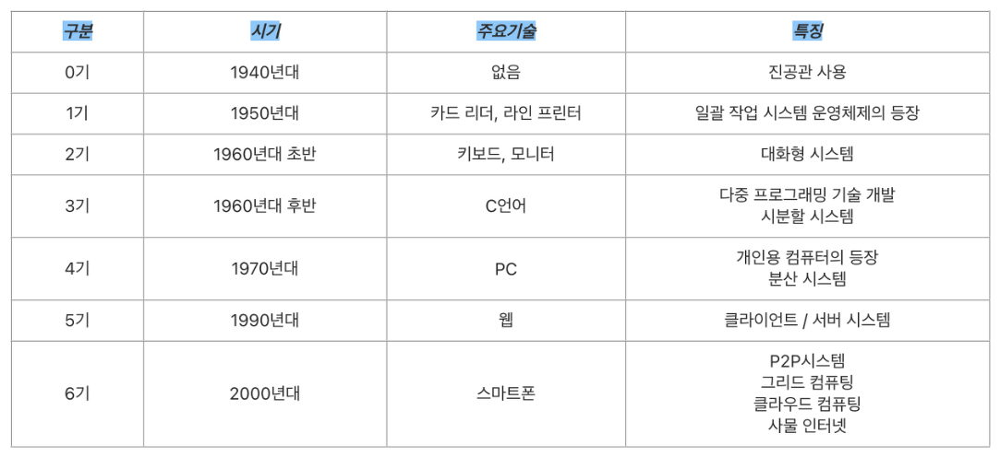
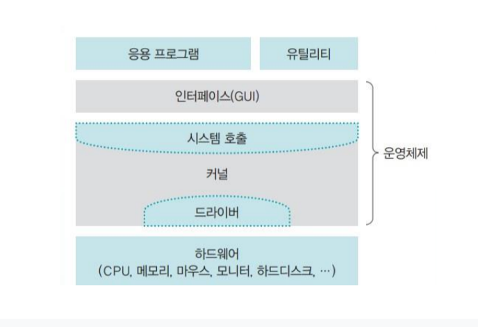

## 1. 운영체제 소개

**일상생활 속의 운영체제**

- 컴퓨터는 운영체제가 없어도 작동하지만, 초기 상태의 기능 외에 다른 기능 추가가 불가함
- 운영체제가 있는 기계는 다양한 응용 프로그램을 설치하여 사용 가능하며, 성능 향상을 위한 새로운 기능을 쉽게 추가할 수 있음
- 운영체제는 성능을 향상할 뿐만 아니라, 자원을 관리하고 편리한 인터페이스 환경을 제공
- 운영체제는 자원(하드웨어)를 보호하기 위해 사용자에게 모든 자원을 숨겨 접근을 막음
- 사용자는 운영체제가 제공하는 사용자 인터페이스와 하드웨어 인터페이스를 이용해 자원에 접근
- 즉 **운영체제는 자원을 관리하고 보호하며, 하드웨어 인터페이스와 사용자 인터페이스를 제공**

**운영체제의 정의**

- 컴퓨터 하드웨어의 바로 위에 설치되어 사용자에게 편리한 인터페이스 환경을 제공하고 컴퓨터 시스템의 자원을 효율적으로 관리하는 소프트웨어
- 좁은의미의 운영체제 : 커널 운영체제의 핵심부분으로 메모리에 상주한다.
- 넓은의미의 운영체제 : 커널 + 각종 주변 시스템 유틸리티 포함(ex. 윈도우깔면 파일복사하는 별도의 SW 등)
- 전공자 입장에서는 OS란 좁은의미의 운영체제인 커널만을 얘기한다.

**운영체제의 역할**

- **CPU 스케줄링 과 프로세스 관리** : CPU 소유권을 어떤 프로세스에 할당할 지, 프로세스의 생성/삭제, 자원 할당/반환 관리
- **메모리 관리** : 한정된 메모리를 어떤 프로세스에 얼만큼 할당해야 하는지 관리
- **디스크 관리** : 디스크 파일을 어떠한 방법으로 보관할 지 관리
- **I/O 디바이스 관리** : I/O 장치간 데이터를 주고받는것을 관리

 

## 2. 운영체제의 역사

**초창기 컴퓨터(1940년대)**

- 최초의 컴퓨터인 에니악은 전선을 잭에 꼽아 회로를 연결(하드와이어링 방식)
- 진공관이라는 소자를 사용하여, 진공관이 켜지면 1, 꺼지면 0이라고 판단하여 2진법 체계를 구축
- 키보드와 마우스, 운영체제가 존재하지 않음

**일괄 작업 시스템(1950년대)**

- IC(Integrated Circuit)라는 작은 논리회로칩이 만들어짐
- CPU와 메인메모리가 있었지만, 키보드나 모니터가 아닌 천공카드 리더와 라인프린터를 입출력 장치로 사용
- 작업에 필요한 프로그램과 데이터를 천공카드 리더로 입력받아 CPU와 메인메모리에서 프로그래밍 후 라인프린터로 출력함
- 이러한 시스템을 **일괄 작업 시스템**, **일괄 처리 시스템**이라고 부른다.

**대화형 시스템(1960년대 초반)**

- 키보드와 모니터가 개발됨으로서 작업 중간에 입력이나 수정이 가능
- 일괄 작업 시스템은 단순 계산 위주의 작업만 가능 했으나, 대화형 시스템의 등장으로 응용 프로그램 개발 가능
- 작업 시간 예측이 어려움

**시분할 시스템(1960년대 후반)**

- 값 비싼 컴퓨터의 효율성을 높이기 위해 다중 프로그래밍 기술이 개발됨
- 하나의 CPU 사용 시간을 아주 잘게 쪼개어 여러 작업에 나누어 줌으로 모든 작업이 동시에 처리되는것처럼 보이는 시분할 시스템, 다중 작업 시스템이라고 함
- 이때 잘게 나뉜 시간을 타임 슬라이스 또는 타임 퀀텀이라고 함
- 시분할 시스템은 하나의 컴퓨터에서 여러명이 작업할 수 있는 다중 사용자시스템을 가능하게 함
- 이 시기에 C언어로 멀티프로그래밍과 다중 사용자를 지원하는 운영체제 유닉스가 개발됨

**분산 시스템(1970년대 후반)**

- 개인 컴퓨터 애플2가 발표되며 소프트웨어가 급속도로 발전
- 또한, 인터넷이 등장하며 아르파넷에서 TCP/IP 프로토콜을 정의함
- 개인용 컴퓨터가 보급되면서 작은 컴퓨터들을 묶어 대형컴퓨터 규모의 시스템을 만드는 것을 분산 시스템이라고 부름
- 분산 시스템은 네트워크 상에 분산되어 있는 여러 컴퓨터로 작업을 처리하고 그 결과를 상호 교환하도록 구성한 시스템

**클라이언트/서버 시스템(1990년대~현재)**

- 분산 시스템은 시스템에 참여하는 컴퓨터중 하나가 고장나거나 추가 되면 작업을 분배하고 결과를 모으기 어려움
- 이를 해결하기 위해 **작업을 요청하는 클라이언트**와 **응답하여 요청받은 작업을 처리하는 서버**의 클라이언트/서버 이중기술이 생김
- 이는 모든 요청이 서버로 집중되기 때문에 서버 과부하를 일으키는 단점이 있음

**P2P 시스템(2000년대 초반~현재)**

- 서버의 부하를 줄일수 있는 P2P(peer to peer) 시스템이 만들어짐
- peer은 말단 노드, 사용자의 컴퓨터를 가리키며 서버를 거치지 않고 사용자와 사용자를 연결함
- P2P기술은 메신저 프로그램이나 파일공유에서 사용됨

**기타 컴퓨팅 환경(2000년대 초반~현재)**

- **그리드 컴퓨팅 :** 분산 시스템의 한 분야로 서로 다른 기종의 컴퓨터들을 묶어 대용량의 컴퓨터 풀을 구성하고 이를 원격지와 연결하여 대용량 연산을 수행하는 컴퓨팅 환경.
- **클라우드 컴퓨팅** : 언제 어디서나 응용 프로그램과 데이터를 자유롭게 사용할 수 있는 컴퓨팅 환경
- **사물 인터넷** : 사물에 센서와 통신기능을 내장하여 인터넷에 연결하는 기술

 

## 3. 운영체제의 구조

**커널과 인터페이스**

운영체제는 크게 커널과 인터페이스 두 부분으로 나뉘어 진다.

- 커널 : 프로세스 관리, 메모리 관리, 저장장치 관리와 같은 운영체제의 핵심적인 기능을 모아놓은것
- 인터페이스(GUI) : 사용자 인터페이스로 사용자의 명령을 커널에 전달하고 실행결과를 알려줌

**시스템 호출과 디바이스 드라이버**

- **시스템 호출** : 커널이 자신을 보호하기 위해 만든 인터페이스. 사용자가 응용 프로그램이 자원에 직접 접근하지 못하게 막음으로써 자원을 보호한다.
  - 동작원리 : 유저프로그램이 I/O 요청으로 트랩(trap)을 발동시키면 올바른 I/O 요청인지 확인한 후 유저모드가 시스템 콜을 통해 커널 모드로 변환되어 실행된다.
  - 시스템 호출이 동작할 때 modebit이라는것을 참고해서 유저모드와 커널 모드를 구분하며 커널모드일 때는 모든 컴퓨터 자원에 접근 가능하며 유저 모드일 때는 접근할 수 있는 영역을 제한한다.
- **드라이버** : 하드웨어의 특성을 반영한(제어하기 위한) 소프트웨어
  - 응용프로그램과 커널의 인터페이스가 시스템 호출이라면 커널과 하드웨어의 인터페이스를 드라이버라고 한다.
  - 하드웨어의 특성을 담은 소프트웨어인 드라이버를 설치하여 하드웨어를 제어할 수 있도록 한다.

**시스템 호출과 유사한 용어**

- **API** : 응용프로그램이 자신과 연관된 프로그램을 만들 수 있도록 제공하는 인터페이스
- **SDK** : 프로그램 개발자를 위해 API 및 개발용 응용프로그램까지 하나로 묶어서 배포하는 개발툴

**커널의 구성**

- 커널은 프로세스 관리, 메모리 관리, 파일 시스템 관리, 입출력 관리, 프로세스 간 통신 관리 등 유기적 얽혀있는 일을 하는데, 이러한 기능을 어떻게 구현하는가에 따라 아래와 같이 나뉨
- **단일형 구조 커널** : 초창기의 운영체제 구조로 핵심 기능을 하는 모듈들이 구분없이 하나로 구성됨 모듈이 거의 분리되지 않아 모듈 간의 통신 비용이 줄어듬. 하지만, 버그나 오류를 처리하기 어렵고, 상호 의존성이 높아 작은 결함이 시스템 전체로 확산될수 있음. 수정이 어려워 이식성도 낮으며, 현재의 운영체제를 구현하기 어려움
- **계층형 구조 커널 :** 비슷한 기능을 가진 모듈을 묶어 하나의 계층으로 만들고 계층간 통신을 통해 운영체제 구현
- **마이크로 구조 커널** : 프로세스 관리, 메모리 관리, 프로세스 간 통신 관리 등 가장 기본적인 기능만 제공

**가상 머신**

- C로 만든 유닉스는 다른 커널을 가진 운영체제와의 호환성이 떨어짐
- 이러한 호환성문제는 운영체제 위에 가상머신인 JVM을 만들고 그 위에서 응용프로그램이 작동하는 JAVA로 해결 가능함
