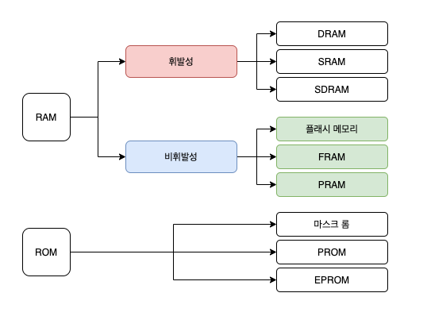

## 1. 컴퓨터의 기본 구성

**하드웨어 구성**

- 컴퓨터는 CPU(중앙처리장치), RAM(메모리), 입력장치, 출력장치, 저장장치로 구성
- CPU : 명령어를 해석하여 실행하는 장치
- RAM : 작업에 필요한 프로그램과 데이터를 저장하는 장소. 바이트 단위로 분할되어 있으며, 분할 공간마다 주소로 구분됨
- 메인보드 : 컴퓨터의 다양한 부품을 연결하는 커다란 판으로 가는 선(버스)가 복잡하게 얽혀있으며 전력이 공급되면 버스로 연결된 부품이 작동됨

**폰노이만 구조**

- CPU, 메모리, 입출력장치, 저장장치가 버스로 연결되어 있는 구조
- **모든 프로그램은 메모리에 올라와야 실행할 수 있음**

 

## 2. CPU와 메모리

**CPU의 구성**

- 산술,논리연산장치(ALU, Arithmetic and Logical Unit) : 데이터의 산술연산과 논리연산을 수행
- 제어장치(CU, Control Unit) : CPU에서 작업을 통제하고 지시. 기억 장치로 부터 명령을 순차적으로 꺼내 해독하고 해석에 따른 작업 지시
- 레지스터(Register) : CPU 내에 데이터를 임시로 보관하는 공간으로 메모리 계층의 최상위에 위치하며 가장 빠른 속도로 접근 가능

**CPU의 동작**

- 보조기억장치(HDD, SSD)에서 저장된 프로그램을 읽거나, 입력장치에서 입력받은 데이터를 RAM에서 읽음
- RAM에서 읽어온 데이터를 CPU가 읽고 처리한 후 다시 RAM으로 보낸 후 저장
- RAM은 연산된 데이터를 출력장치에 보내거나 보조기억장치에 저장
- 제어장치에서 명령어를 해석하여 제어 신호를 보내고 CPU 내의 데이터 흐름을 조절

**레지스터의 종류**

- 데이터 레지스터(DR) : CPU가 명령어를 처리하는데 필요한 일반 데이터를 임시로 저장하는 범용 레지스터
- 주소 레지스터(AR) : 데이터 또는 명령어가 저장된 메모리의 주소를 저장. 범용 레지스터
- 프로그램 카운터(PC) : 다음에 실행할 명령어의 위치정보(코드의 행번호, 메모리 주소)를 저장. 특수 레지스터
- 명령어 레지스터(IR) : 현재 실행중인 명령어를 저장. 특수 레지스터
- 메모리 주소 레지스터(MAR) : 메모리 관리자가 접근해야 할 메모리의 주소를 저장
- 메모리 버퍼 레지스터(MBR) : 메모리 관리자가 메모리에서 가져온 데이터를 임시로 저장
- 프로그램 상태 레지스터(PSR) : 연산 결과(양수, 음수)를 저장

**버스의 종류**

- 제어 버스 : 제어장치와 연결된 버스, CPU가 메모리와 주변 장치에 제어 신호를 보내기 위해 사용. 메모리와 주변장치에서도 작업이 완료되거나 오류가 발생하면 제어 신호를 보내기 때문에 양방향
- 주소 버스 : MAR과 연결된 버스로, 메모리나 주변장치에 데이터를 읽거나 쓸때 위치정보를 보내기 위해 사용하며 단방향
- 데이터 버스 : MBR과 연결된 버스로, 데이터의 이동이 양방향으로 이루어짐
- 버스의 대역폭은 한번에 전달할수 있는 데이터의 최대 크기를 의미

**메모리의 종류**

- 메모리는 읽거나 쓸 수 있는 램과 읽기만 가능한 롬으로 구분
- 휘발성 메모리 : 전력이 끊기면 데이터가 사라지며 동적램과 정적램이 있음
- 비휘발성 베모리 : 전력이 끊겨도 데이터를 보관할 수 있음
- 롬 : 전력이 끊겨도 데이터를 보관할 수 있어 주로 바이오스(BIOS)를 저장

**메모리 보호 및 부팅**

- 메모리를 보호하기 위해 CPU는 현재 진행중인 작업의 메모리 시작 주소를 경계 레지스터에, 현재 작업이 차지하고 있는 메모리의 크기를 한계 레지스터에 저장해 작업이 진행되면서 두 레지스터의 주소 범위를 벗어나는치 체크함으로써 메모리를 보호
- 부팅 : 컴퓨터를 켰을때 운영체제를 메모리에 올리는 과정. 바이오스는 주요하드 웨어 이상여부를 확인후 이상이 없으면 메모리에 부트스트랩 코드로 운영체제를 실행

 

## 3. 컴퓨터 성능 향상 기술

**버퍼와 스풀**

- 버퍼 : 일정량의 데이터를 모아 옮김으로써 속도에 차이가 있는 두 장치 사이에서 그 차이를 완화함
- 스풀 : CPU와 입출력장치가 독립적으로 동작하도록 고안된 소프트웨어적 버퍼

**캐시**

- 캐시는 메모리와 CPU 간의 속도 차이를 완화하기 위해 메모리의 데이터를 미리 가져와 저장해두는 임시 장소로 캐시 적중률이 높을수록 성능이 좋음

**저장장치의 계층구조**

- 속도가 빠르고 값이 비싼 저장장치를 CPU 가까운쪽에 두고 값이 싸고 큰 저장장치를 반대쪽에 배치하여 빠른속도와 큰 용량 확보

**인터럽트**

- **인터럽트** : CPU가 입출력 관계자에게 입출력 명령을 보낸 후, 입출력 관리자는 명령받은 데이터를 메모리에 가져다 놓거나, 메모리에 있는 데이터를 저장장치로 옮기는데 이러한 처리가 완료되고 **입출력 관리자가 CPU에게 보내는 신호**
- **인터럽트 벡터** : 여러 개의 인터럽트를 하나의 배열로 만든 것으로 ISR(Interrupt Service Routine)의 주소를 보관
- **직접 메모리 접근(Direct Memory Access, DMA)** : CPU의 허락없이 메모리에 접근할수 있는 권한
- **메모리 매핑 입출력** : 직접 메모리 접근을 사용했을때의 복잡성을 해결하기 위한 방법으로, CPU가 사용하는 메모리 공간과, 입출력 작업 영역을 분리하여 메모리의 공간을 나누는 방법
- **사이클 훔치기** : CPU와 입출력 장치가 동시에 메모리에 접근할때 CPU가 사용 권한을 양보하는것

 

## 4. 병렬 처리

**병렬처리**

- 동시에 여러 개의 명령을 처리하여 작업의 능률을 높이는 기법
- 상호 의존성이 없어야 병렬처리 가능하며, 병렬처리의 깊이를 잘 확인해야 함
- 각 단계의 시간을 거의 일정하게 맞춰야 원만한 병렬처리가 이루어지며 병목현상이 발생함

**병렬처리 기법**

- 스레드 : 제어 장치는 명령어를 가져와 해석한 후 실행하고 결과를 저장하는 과정
- 명령어 처리 단계 : 명령어 패치 → 명령어 해석 → 실행 → 쓰기
- 파이프라인 기법 : CPU의 사용을 극대화하기 위해 명령을 겹쳐서 실행하는 방법으로 하나의 코어에 여러 스레드를 사용
