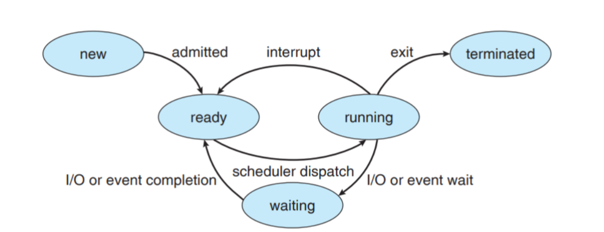
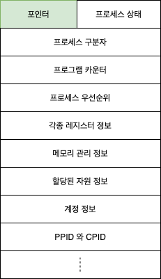

## 1. 프로세스의 개요

**프로그램과 프로세스**

- 프로그램(Program) : 저장장치에 저장되어 있는 정적인 상태로 파일 시스템의 실행 파일
- 프로세스(Process) : 실행을 위해 메모리에 올라온 동적인 상태, 실행중인 프로그램, 프로그램을 실행시키는 실행 주체
- 프로그램은 운영체제로부터 **프로세스 제어블록**을 얻어 프로세스가 되며, 프로세스 제어 블록이 폐기 됨으로서 프로세스가 종료됨
- 운영체제 또한 프로그램이기 때문에 컴퓨터는 일반 사용자의 **사용자 프로세스(user process)** 와 운영체제의 **커널 프로세스(kernerl process)** 가 섞여서 실행됨

**프로세스의 상태(표)**

- **생성 상태** : 프로그램을 메모리에 가져와 실행 준비가 완료된 상태. 메모리 할당
- **준비 상태** : 실행을 기다리는 모든 프로세스가 자기 차례를 기다리는 상태. 실행될 프로세스는 CPU 스케줄러가 선택
- **실행 상태** : 선택된 프로세스가 타임 슬라이스를 얻어 CPU를 사용하는 상태. 프로세스 사이의 문맥 교환이 일어남
- **대기 상태** : 실행 상태에 있는 프로세스가 입출력을 요청하면 입출력이 완료될 때까지 기다리는 상태. 입출력이 완료되면 준비 상태로 감
- **완료 상태** : 프로세스가 종료된 상태. 사용하던 모든 데이터가 정리됨. 정상 종료인 exit와 비정상 종료인 abort를 포함

 

## 2. 프로세스 제어 블록과 문맥 교환

**프로세스 제어 블록(PCB, Process Control Block)**

- 프로세스를 실행하는데에 중요한 정보를 보관하는 자료구조
- 모든 프로세스는 고유의 프로세스 제어 블록을 가지며, 프로세스 제어 블록은 프로세스 생성 시 만들어지고, 프로세스가 실행을 완료하면 폐기됨

**문맥 교환**

- CPU를 차지하던 프로세스가 나가고 새로운 프로세스를 받아들이는 작업으로 두 프로세스의 프로세스 제어 블록을 교환하는 작업

 

## 3. 프로세스의 연산

**프로세스의 구조**

- **코드영역** :
  프로그램의 본문이 기술된 영역으로 텍스트영역이라고도 함
- **데이터영역** :
  코드가 실행되면서 사용하는 변수나 파일 등의 각종 데이터를 모아놓은 곳
- **스택영역** :
  함수가 호출될 때 관계되는 영역으로 변수의 스코프나 함수가 호출된 메모리 주소 등을 저장함.
- **힙영역** :
  사용자에 의해 동적으로 메모리 공간을 할당하고 해제하는 영역. 메모리 주소값에 의해서 참조되고 사용됨
- 코드영역과 데이터 영역은 프로세스가 실행되기 직전에 위치와 크기가 결정되므로 정적 할당영역이지만, 스택영역과 힙 영역은 프로세스가 실행되는 동안 만들어지는 영역으로 동적 할당 영역

**프로세스의 생성과 복사**

- **fork()** : 실행 중인 프로세스로 부터 새로운 프로세스를 복사하는 함수. 이때 실행하던 프로세스는 부모 프로세스, 새로 생긴 프로세스는 자식 프로세스로서 부모-자식 관계가 됨. 이때 프로세스 구분자, 메모리의 위치, PPID, CPID값이 달라짐.
- fork() 시스템 호출시 프로세스 생성 속도가 빨라지고, 추가 작업 없이 자원을 상속할 수 있으며, 시스템 관리를 효율적으로 할 수 있음

**프로세스의 전환**

- exec() : 기존의 프로세스를 새로운 프로세스로 전환하는 함수. 이미 만들어진 프로세스의 구조를 재활용 하는것

**프로세스의 계층 구조**

- 부모 프로세스를 복사하여 자식 프로세스를 만들때 생기느 부모-자식간의 계층구조

 

## 4. 스레드

**스레드의 개념**

- 프로세스의 코드에 정의된 절차에 따라 CPU에 작업 요청을 하는 실행 단위
- 멀티 스레드 : 프로세스 내 작업을 여러 개의 스레드로 분할함으로써 작업의 부담을 줄이는 프로세스 운영 기법
- 멀티 태스킹 : 운영체제가 CPU에 작업을 줄 때 시간을 잘게 나누어 배분하는 기법
- 멀티 프로세싱 : cpu를 여러 개 사용하여 여러 개의 스레드를 동시에 처리하는 작업 환경
- CPU 멀티 스레드 : 한 번에 하나씩 처리해야 하는 스레드를 파이프라인 기법을 이용하여 동시에 여러 스레드를 처리하도록 만든 병렬 처리 기법
- 멀티스레드 : 운영체제가 소프트웨어적으로 프로세스를 작은 단위의 스레드로 분할하여 운영하는 기법
- CPU 멀티 스레드 : 하드웨어적인 방법으로 하나의 CPU에서 여러 스레들를 동시에 처리하는 병렬처리 기법

**멀티 스레드의 장점**

- **응답성 향상 :** 한 스레드가 입출력으로 인해 작업이 진행되지 않더라도 다른 스레드가 작업을 계속하여 사용자의 작업 요구에 빨리 응답 가능
- **자원 공유** : 한 프로세스 내에서 독립적인 스레드를 생성하면 프로세스가 가진 자원을 모든 스레드가 공유하게 되어 원할한 작업 진행 가능
- **효율성 향상** : 불필요한 자원의 중복을 막음으로써 시스템 효율 향상
- **다중 CPU 지원** : 2개 이상의 CPU를 가진 컴퓨터에서 멀티 스레드를 사용하면 다중 CPU가 멀티 스레드를 동시에 처리하여 CPU 사용량이 증가하며, 프로세스의 처리 시간이 단축됨

**멀티 스레드 모델**

- **사용자 레벨 스레드** : 사용자 레벨에서 관련 라이브러리를 사용하여 구현하며, 라이브러리는 커널이 지원하는 스케줄링이나 동기화 같은 기능을 대신 구현해줌
- **커널 레벨 스레드** : 커널이 멀티 스레드를 지원하는 방식
- **멀티 레벨 스레드** : 사용자 레벨 스레드와 커널 레벨 스레드를 혼합한 방식으로 하이브리드 스레드라고도 함
