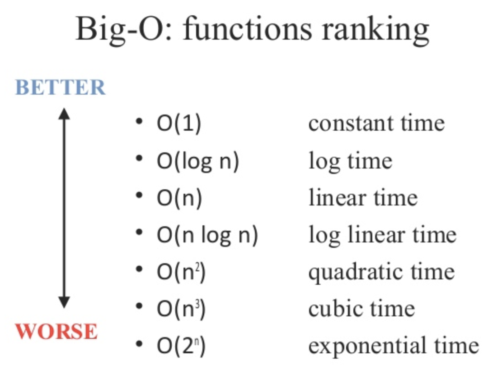
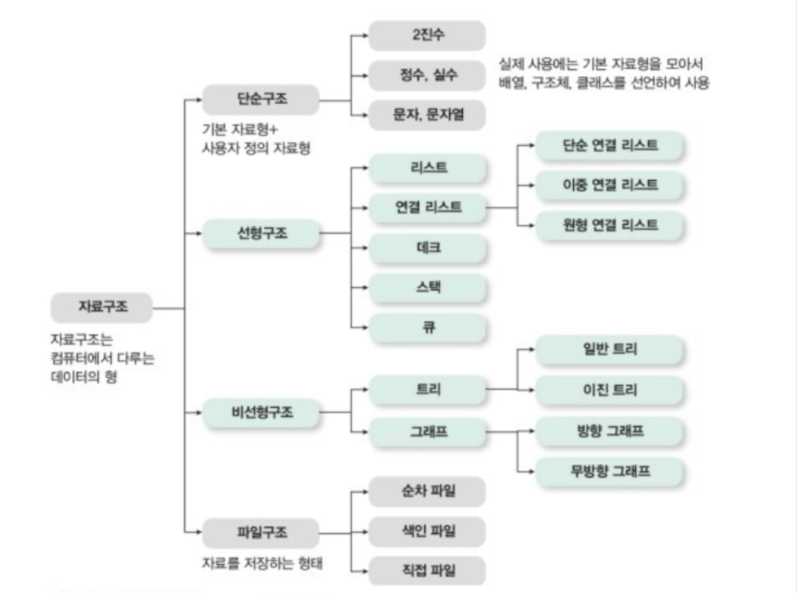
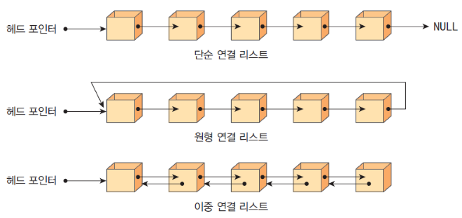
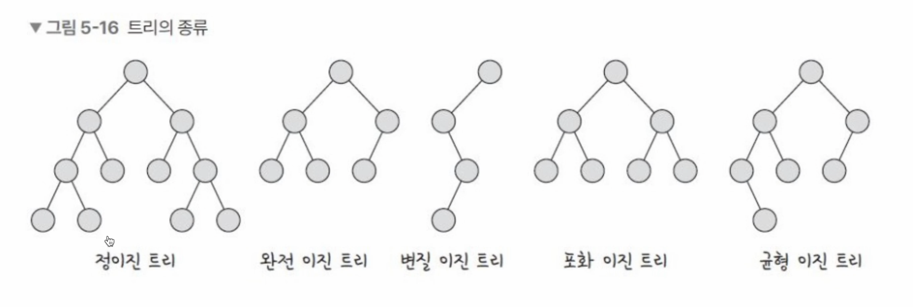

### 복잡도

- **알고리즘의 성능을 나타내는 척도**로 시간복잡도와 공간복잡도로 나뉘어진다.
- 복잡도가 낮을수록 좋은 알고리즘이다.

### 빅오(Big-O) 표기법

가장 빠르게 증가하는 항만 고려하는 표기법으로 함수의 상한만을 나타내는 표기법



### 시간 복잡도

- 알고리즘을 수행하는 데 연산들이 몇 번 이루어지는 지, 걸리는 시간 나타내는 숫자
- 많이 다루어 지는 시간 복잡도
  | 상수 시간 - O(1) | 정수의 홀/짝 여부 판별, 배열 요소 접근 |
  | ---------------------------- | ------------------------------------------ |
  | 로그 시간 - O(logN) | 이진 탐색 |
  | 선형 시간 - O(N) | 정렬되지 않은 자료 구조에서 특정 원소 탐색 |
  | 선형 로그 시간 - O(NlogN) | 병합 정렬, 힙 정렬, 고속 푸리에 변환 |
  | 이차(또는 제곱) 시간 - O(N²) | 버블 정렬, 삽입 정렬 |
  | 지수 시간 - O(2ⁿ) | 조합(Combination) |
- 시간 제한이 1초 일때 알고리즘 설계
  - N의 범위가 500인 경우 : 시간 복잡도가 `O(N^3)`인 알고리즘 설계
  - N의 범위가 2,000인 경우 : 시간 복잡도가 `O(N^2)`인 알고리즘 설계
  - N의 범위가 100,000인 경우 : 시간 복잡도가 `O(NlogN)`인 알고리즘 설계
  - N의 범위가 10,000,000인 경우 : 시간 복잡도가 `O(N)`인 알고리즘 설계
  - N의 범위가 10,000,000,000인 경우: 시간 복잡도가 `O(logN)` 이하인 알고리즘을 설계

### 공간 복잡도

- 프로그램을 실행시킨 후 완료하는 데 필요로 하는 자원 공간의 양
- 메모리 제한에 따른 알고리즘 설계
  - `int a[1,000]` : 4KB
  - `int a[1,000,000]` : 4MB
  - `int a[2,000][2,000]` : 16MB

### 자료구조 별 시간 복잡도

| 자료구조         | 접근    | 탐색    | 삽입    | 삭제    |
| ---------------- | ------- | ------- | ------- | ------- |
| 배열             | O(1)    | O(n)    | O(n)    | O(n)    |
| 스택             | O(n)    | O(n)    | O(1)    | O(1)    |
| 큐               | O(n)    | O(n)    | O(1)    | O(1)    |
| 이중 연결 리스트 | O(n)    | O(n)    | O(1)    | O(1)    |
| 해시 테이블      | O(1)    | O(1)    | O(1)    | O(1)    |
| 이진 탐색 트리   | O(logN) | O(logN) | O(logN) | O(logN) |
| AVL 트리         | O(logN) | O(logN) | O(logN) | O(logN) |
| 레드 블랙 트리   | O(logN) | O(logN) | O(logN) | O(logN) |

### 자료구조



- 데이터를 효율적으로 표현, 관리, 처리하기 위한 데이터 구조
- 자료구조는 크게 선형 자료구조와 비선형 자료구조로 구분된다.
- 선형 자료구조
  - 각 요소가 일렬로 나열되어 있는 자료구조
  - 종류 : `Linked List`, `Array`, `Stack`, `Queue`
- 비선형 자료구조
  - 각 요소가 연결되어 있지 않고 주로 계층적이거나 네트워크 형태로 배치되는 자료구조
  - 종류 : `Graph`, `Tree`, `Heap`, `Priority Queue`, `Map`, `Set`, `Hash`

### 연결리스트



- 데이터를 감싼 노드를 포인터로 연결해 공간적으로 효율적인 자료구조
- 구분
  - 싱글 연결 리스트 : `next` 포인터만 가지는 연결리스트
  - 이중 연결 리스트 : `prev`, `next` 포인터를 가지는 연결리스트
  - 원형 이중 연결 리스트 : 이중 연결 리스트의 마지막 노드 `tail`의 `next` 포인터가 첫 노드의 `head` 노드를 가르켜 순환 구조를 가지는 연결리스트

### 배열

- 크기가 정해져 있으며 같은 타입의 값을 연속적인 형태(밀집배열)
- js에서의 배열은 여러개의 값을 연속적인 형태로 나열한 자료구조로 일반적인 배열의 동작을 흉내낸 특수한 객체이다.(희소배열)
- 다른 언어에서는 벡터라는 동적 배열을 사용
- 접근 방식
  - 직접 접근(랜덤접근)
    - 순차적인 데이터에서 어떤 인덱스에 위치하든 동일한 시간내에 접근
    - ex) 배열
  - 순차적 접근
    - 데이터를 처음부터 저장된 순서대로 탐색하여 접근
    - 특정 요소에 도달하기 위해 이전 요소를 모두 거쳐야 함
    - ex) 연결리스트
  - 탐색은 랜덤접근(배열)이 빠르고 추가는 순차적접근(연결리스트)이 빠르다.

### 스택(FILO)

- 데이터의 삽입과 삭제가 데이터의 한쪽 끝에서만 일어나는 자료구조
- 선입 후출 구조이며 재귀함수나 웹브라우저 방문 기록등에 사용됨

### 큐(FIFO)

- 데이터의 양방향에서 삽입과 삭제가 일어나는 자료구조를 의미
- 선입 선출 구조이며 CPU 준비큐, 스레드 행렬, BFS, 캐시 등에서 사용됨

### 데크

- Double-Ended queue 로 양방향에서 모두 삽입과 삭제가 가능한 자료구조
- 원형큐를 기반으로 구현한다.

### 그래프

- **노드(Node)** 와 그 노드를 연결하는 **간선(Edge)** 으로 표현되는 자료구조
- 연결되어 있는 객체간의 관계를 표현할 수 있음(네트워크 모델)
- 간선과 노드 사이의 비용을 가중치라고 표현한다.
- 구분
  - 방향 그래프 vs 무방향 그래프
  - 연결 그래프 vs 비연결 그래프
  - 순환 그래프 vs 비순환 그래프
- 구현방법

  - 인접 행렬(Adjacency Matrix)

    - 2차원 배열로 그래프의 연결 관계를 표현하는 방식
    - 간선의 숫자가 적은 희소 그래프일 경우 유리
    - 구현(py)

      ```python
      inf = 99999999

      graph = [
        [0, 7, 5],
        [7, 0, inf],
        [5, inf, 0]]

      print(graph)
      ```

  - 인접 리스트(Adjacency List)

    - 리스트로 그래프의 연결 관계를 표현하는 방식
    - 간선의 숫자가 많은 밀집 그래프일 경우 유리
    - 구현(py)

      ```python
      graph = [[] for _ in range(3)]
      print(graph)

      graph[0].append((1, 7))
      graph[0].append((2, 5))
      graph[1].append((0, 7))
      graph[2].append((0, 5))

      print(graph)
      ```

- 탐색 : 그래프는 일반적으로 `bfs`/`dfs`로 탐색한다.

### 트리

- 노드와 노드가 연결된 자료구조
- 트리의 특징
  - 방향성이 없는 비순환 그래프의 한 종류
  - 트리는 부모 자식의 계층 구조를 가진다.
  - 모든 노드간의 경로는 유일무이하다.
  - 트리에서 일부를 떼어내도 트리 구조이며 이를 서브 트리라고 한다.
  - 노드가 N개일때 간선의 개수는 항상 N-1개
  - 트리는 계층적이고 정렬된 데이터를 다루기에 적합(ex. 파일시스템)
- 관련 용어
  - 루트노드 : 부모가 없는 최상단 노드. 모든 트리는 하나의 루트노드를 가짐
  - 리프 노드 : 자식이 없는 최하단 노드. 단말노드라고 하기도 함
  - 형제 노드 : 같은 부모를 가지는 노드
  - 내부 노드 : 루트노드와 리프노드 사이의 노드
  - 노드의 크기 : 자신을 포함한 모든 자손 노드의 개수
  - 노드의 깊이 : 루트에서 어떤 노드에 도달하기 위해 거쳐야 하는 간선의 수
  - 노드의 레벨 : 트리의 특정 깊이를 가지는 노드의 집합
  - 노드의 차수 : 하위 트리 개수 / 간선 수 (degree) = 각 노드가 지닌 가지의 수
  - 트리의 차수 : 트리의 최대 차수
  - 트리의 높이: 루트 노드에서 가장 깊숙히 있는 노드의 깊이

### 이진 트리

- 자식 노드의 수가 두개 이하인 트리
- (모양을 기준으로) 다음과 같이 분류됨
  
  - 정이진 트리 : 모든 내부 노드가 2개의 자식을 가지며 모든 리프노트가 같은 깊이를 가짐
  - 완전 이진 트리 : 마지막 레벨을 제외하고 모든 레벨이 꽉 참
  - 변질 이진 트리 : 모든 노드가 하나의 자식만 가짐
  - 포화 이진 트리 : 모든 노드가 0개 또는 2개의 자식을 가지며 왼쪽부터 채워져야 함.
  - 균형 이진 트리 : 모든 노드의 왼쪽 서브트리와 오른쪽 서브트리의 높이 차이가 1 이하인 트리.

### 다진트리

- 각 노드가 최대 M개의 자식을 가질 수 있는 트리로 M-ary 트리라고도 함
- 종류
  - 트라이 : 문자열을 저장하고 효율적으로 검색하기 위한 트리
  - B-트리, B+ 트리
  - 3진트리, 4진트리
  - 2-3트리, 2-3-4 트리

### 이진 탐색 트리

- 모든 노드의 왼쪽 서브트리는 부모보다 작은 값, 오른쪽 서브트리는 부모보다 큰 값을 가지며 중복된 값이 없는 트리
- 특징
  - 이진 탐색이 동작할 수 있도록 효율적인 탐색이 가능한 자료구조
  - 검색에 용이하다.
- 종류
  - AVL 트리
    - 스스로 균형을 잡는 이진 탐색 트리(균형트리)
    - 모든 노드의 두 자식 서브트리의 높이는 항상 1 이하
    - 삽입과 삭제 후 트리의 균형을 유지하기 위해 회전 연산 사용
  - 레드-블랙 트리
    - 빨간색과 검정색의 추가 비트를 사용하여 균형을 잡는 이진 탐색 트리
    - 삽입과 삭제 후 트리의 균형을 유지하기 위해 회전 연산 사용
  - Splay Tree, Treap 등

### 우선순위 큐

- 큐에 우선순위의 개념을 도입한 자료구조로 우선순위가 높은 요소가 우선순위가 낮은 요소보다 먼저 제공된다.
- 배열, 연결리스트, 힙으로 구현이 가능하지만 일반적으로 힙을 통해 구현한다.
- 예시: 네트워크 트래픽 제어, 운영 체제에서의 작업 스케쥴링, 수치 해석적인 계산

### 힙

- 완전 이진 트리 기반의 종류중 하나. 중복된 값을 허용한다.
- 우선순위 큐를 위해 만들어진 자료구조로 최대값과 최소값을 빠르게 찾아내도록 만들어진 자료구조
- 최소 힙과 최대 힙으로구분되며 해당 힙에 따른 특징을 지킨 트리를 의미한다.
  - 최소 힙 : 자식 노드보다 부모 노드의 값이 작은 트리
  - 최대 힙 : 자식 노드보다 부모 노드의 값이 큰 트리
- 배열로 구현함

### 맵

- 특정 순서에 따라 키와 매핑된 값의 조합으로 형성된 자료구조
- 레드 블랙 트리 자료구조를 기반으로 형성되며 삽입하면 자동으로 정렬된다.

### 셋

- 중복되지 않는 유일한 값들의 집합으로 요소 순서에 의미가 없다.

### 해시 테이블

- 해시 함수를 사용하여 데이터를 저장하고 검색하는 자료구조
- 해시 함수는 임의의 데이터를 해시 값으로 매핑하여 해시 테이블에 저장한다.
- 빠르고 순서가 없음
