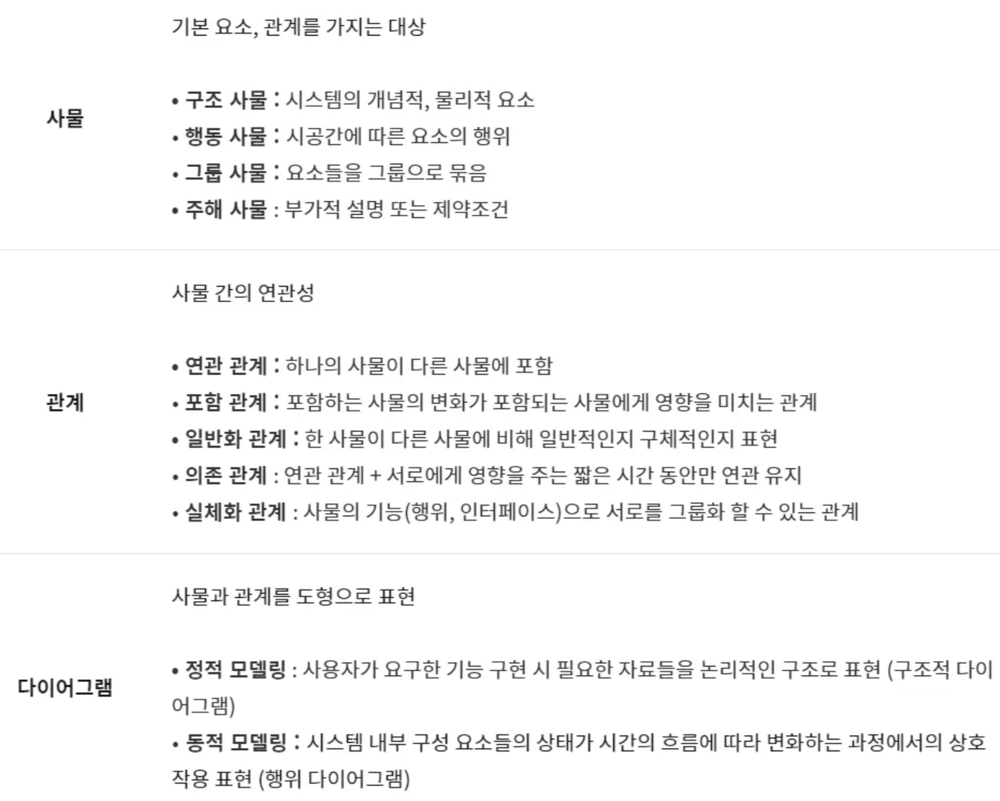

`created at 2021.09.23`

## 1️⃣ **UI 요구사항 확인**

▶️ **UI 유형**

- CLI (Command Line Interface) : 명령어를 텍스트로 입력하여 조작
- GUI (Graphical User Interface) : 그래픽 환경을 기반으로 마우스나 전자펜을 이용
- NUI (Natural User interface) : 신체부위를 이용하여 조직
- OUI (Organic User Interface) : 현실에 존재하는 모든 사물이 입출력장치로 변화할 수 있는 사용자 인터페이스

**▶ UI 설계 원칙(직유학유)**

⦁  직관성(Intuitiveness) : 누구나 쉽게 이해하고, 쉽게 사용할 수 있어야 한다.

⦁  유효성(Efficiency) : 정확하고 완벽하게 사용자의 목표가 달성 될 수 있도록 제작한다.

⦁  학습성(Learnability) : 모두가 쉽게 배우고 사용할 수 있어야 한다.

⦁  유연성(Flexibility) : 사용자의 인터랙션을 최대한 포용하고, 실수를 방지할 수 있도록 제작

**▶ UI 설계 지침(사일단결 가오표접명)**

⦁  단순성 : 조작 방법은 가장 간단하게 작동되도록 해 인지적 부담 최소화

⦁  가시성 : 주요 기능을 메인 화면에 노출해 쉬운 조작이 가능해야 함

⦁  일관성 : 사용자가 기억하기 쉽고 빠르게 습득할 수 있도록 설계

⦁  명확성 : 사용자가 개념적으로 쉽게 인지해야 함

**▶ UI 품질 요구사항(ISO/IEC 9126 기반)**

⦁  기능성(Functionality) : 적절성, 정밀성, 상호 운용성, 보안성, 호환성

⦁  신뢰성(Reliability) : 성숙성, 고장 허용성, 회복성

⦁  사용성(Usability) : 이해성, 학습성, 운용성

⦁  효율성(Efficiency) : 시간 효율성, 자원 효율성

⦁  유지보수성(Maintainability) : 분석성, 변경성, 안정성, 시험성

⦁  이식성(Portability) : 적용성, 설치성, 대체성

**▶ UI 개발을 위한 주요 기법**

⦁  3C 분석 : 고객(Customer), 자사(Company), 경쟁사(Competitor) 비교하고 분석

⦁  SWOT 분석 : 기업 내부 환경과 외부환경을 분석해 Strength, Weakness, Opportunity, Threat 요인을 규정하고 이를 토대로 경영 전략 수립

⦁  시나리오 플래닝 : 상황 변화를 사전에 예측하고 다양한 시나리오 설계하는 방법

⦁  사용성 테스트(Usability Test) : 사용자가 직접 제품을 사용하면서 미리 작성된 시나리오에 맞추어 과제를 수행 한 후, 질문에 답하도록 하는 테스트

**▶ UI 화면 설계 구분(스와프)**

⦁  스토리 보드 : 정책, 프로세스, 와이어 프레임, 기능 정의, 데이터베이스 연동 등 서비스 구축을 위한 정보가 수록된 문서, 디자이너와 개발자가 최종적으로 참고하는 산출 문서

⦁  와이어 프레임 : 화면 단위의 레이아웃을 설계한는 작업

⦁  프로토타입 : 정적인 화면(와이어 프레임, 스토리보드)에 동적 효과를 적용해 실제 구현된 것처럼 시뮬레이션 할 수 있는 모형

## 2️⃣ **UI 설계**

</aside>

**▶ UML**

- 객체 지향 소프트웨어 개발 과정에서 산출물을 명세화, 시각화, 문서화할때 사용되는 모델링 기술과 방법론을 통합해서 만든 표준화된 범용 모델링 언어

**▶ UML의 특징(가구명문)**

- 가시화 언어, 구축언어, 명세화언어, 문서화언어

**▶ UML의 구성요소(사관다)**

**▶ UML 다이어그램**

- UML 다이어그램은 구분에 따라 구조적(정적)다이어그램, 행위적(동적)다이어그램으로 나뉨
- 컴포넌트, 배치 다이어그램은 구현단계에서 사용됨

**▶ UML 구조적(정적) 다이어그램 (클객 컴배 복패) 책보기**

- 클래스(Class) 다이어그램
- 객체(Object) 다이어그램
- 컴포넌트(Component) 다이어그램
- 배치(Deployment) 다이어그램
- 복합체 구조(Composite Structure) 다이어그램
- 패키지(Package) 다이어그램

**▶ UML 구조적(정적) 다이어그램 (유시커 상활타) 책보기**

- 유스케이스 다이어그램
- 시퀀스 다이어그램
- 커뮤니케이션 다이어그램
- 상태 다이어그램
- 활동 다이어그램
- 타이밍 다이어그램
