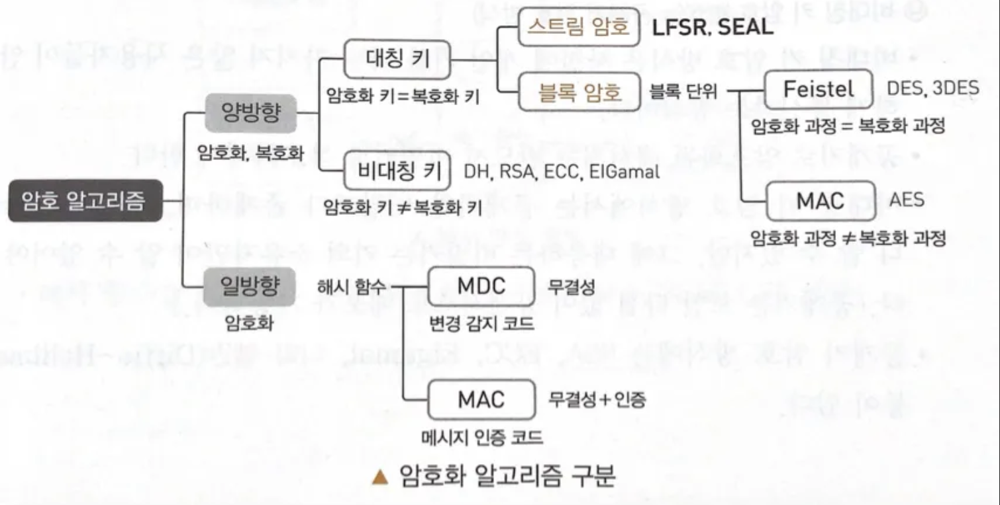

`created at 2021.10.11`

## 1️⃣ 소프트웨어 개발 보안 설계

</aside>

**▶ SW 개발 보안의 3대 요소**

⦁  기밀성(Confidentiality) : 인가되지 않은 개인 혹은 시스템 접근에 따른 정보 공개 및 노출을 차단하는 특성

⦁  무결성(Integrity) : 정당한 방법을 따르지 않고서는 데이터가 변경 될 수 없으며, 데이터의 정확성 및 완전성과 고의/악의로 변경되거나 훼손되지 않음을 보장

⦁  가용성(Availability) : 권한을 가진 사용자나 애플리케이션이 원하는 서비스를 지속해서 사용할 수 있도록 보장하는 특성

**▶ SW 개발 보안 용어**

⦁  자산 : 조직의 데이터

⦁  위협(Threat) : 조직이나 기업의 자산에 악영향을 끼칠 수 있는 사건이나 행위

⦁  취약점(Vulnerability) : 위협이 발생하기 위한 사전 조건

⦁  위험(Risk) : 위협이 취약점을 이용해 조직의 자산 손실 피해를 가져올 가능성

## 💡 공격기법 종류

</aside>

**▶ DoS(Denial of Service)**

시스템을 악의적으로 공격해 해당 시스템의 자원을 부족하게 해 사용하지 못하게 하는 공격

**▶ DoS 공격의 종류**

⦁  SYN 플러딩(Flooding) : TCP 프로토콜의 구조적 문제를 이용한 공격, SYN 패킷만 보냄

⦁  UDP 플러딩(Flooding) : 대량의 UDP 패킷을 만들어 임의의 포트 번호로 전송

⦁  스머프(Smurf)/스머핑(Smurfing) : 출발지 주소를 공격 대상의 IP로 설정하여, 네트워크 전체에게 ICMP Echo 패킷을 직접 브로드 캐스팅해 마비시킴

⦁  죽음의 핑(PoD) : ICMP 패킷(핑)을 정상적인 크기보다 아주 크게 만들어 전송

⦁  랜드 어택 : 출발지 IP와 목적지 IP를 같은 패킷 주소로 만들어 보내, 수신자가 자기 자신에게 응답

⦁  티어 드롭 : IP 패킷의 재조합 과정에서 잘못된 Fragment Offset 정보로 인해 수신 시스템이 단편화된 패킷의 재조합 과정에서 문제를 발생하도록 만드는 Dos 공격, IP 헤더가 조작된 일련의 IP 패킷 조각들을 전송

⦁  봉크(Bonk) : 같은 시퀀스 번호 계속 보냄

⦁  보잉크(Boink) : 일정한 간격으로 시퀀스 번호에 빈 공간 생성

---

**▶ DDoS(Distrivuted DoS)**

여러 대의 공격자를 분산 배치해 동시에 동작하게 함으로써 특정 사이트 공격

**▶ DDoS 공격 구성요소**

⦁  핸들러(Handler) : 마스터 시스템의 역할을 수행

⦁  에이전트(Agent) : 공격 대상에 직접 공격을 가하는 시스템

⦁ 마스터(Master) : 공격자에게 직접 명령을 받는 시스템, 여러대의 에이전트를 관리

⦁ 공격자(Attacker) : 공격을 주도하는 해커의 컴퓨터

⦁  데몬 프로그램(Daemon) : 에이전트 시스템의 역할을 수행하는 프로그램

**▶ DDoS 공격 도구**

⦁  Trinoo : 많은 소스로부터 통합된 UDP flood 서비스 거부 공격을 유발하는데 사용

⦁  TFN(Tribe Flood Network) : Trinoo와 비슷한 분산 도구, 많은 소스에서 하나 혹은 여러 개의 목표 시스템에 대해 서비스 거부 공격

⦁  Stacheldraht : 분산 서비스 거부 에이전트 역할

---

**▶ DRDoS(Distributed Refleection DoS) 공격**

⦁ 공격자는 출발지 IP를 공격대상 IP로 위조하여 다수의 반사 서버로 요청 정보를 전송, 공격 대상자는 반사 서버로부터 다량의 응답을 받아서 서비스 거부(DoS)가 되는 공격이다.

⦁ 출발지 IP변조 → 공격 대상자 서버로 응답 → 서비스 거부

---

**▶ 애플리케이션 공격(DDoS 서비스 마비 공격)**

⦁  HTTP GET Flooding : 과도한 Get 메시지를 이용해 웹 서버의 과부하를 유발시키는 공격

⦁  Slow HTTP Header DoS : HTTP GET 메서드를 사용해 헤더의 최종 끝을 알리는 개행 문자열을 전송하지 않음

⦁  Slow HTTP POST DoS : 요청 헤더의 Content-length를 비정상적으로 크게 설정하고 메시지 바디 부분을 매우 소량을 보냄

⦁  Slow HTTP Read DoS : TCP 윈도 크기와 데이터 처리율을 감소시킨 상태에서 다수 HTTP 패킷을 지속적으로 전송

⦁  Hulk DoS : 공격자가 공격대상 웹사이트 URL을 지속적으로 변경하면서 다량으로 GET 요청을 발생시키는 서비스 거부 공격

⦁  Hash DoS : 해시 충돌 발생시킴

---

**▶ 네트워크 공격**

⦁  스니핑(Sniffing) : 공격대상에게 직접 공격 하지 않고 데이터만 몰래 들여다보는 수동적 공격

⦁  네트워크 스캐너(Scanner), 스니퍼(Sniffer) : 공격자가 HW, SW 구성의 취약점을 탐색하는 공격 도구

⦁  IP 스푸핑(Spoofing) : 침입자가 인증된 컴퓨팅 시스템인 것처럼 속여 정보를 빼내기 위해 본인의 패킷 헤더를 인증된 호스트의 IP 어드레스로 위조해 타깃에 전송

⦁  ARP 스푸핑(Spoofing) : 공격자가 특정 호스트의 MAC 주소를 자신의 MAC 주소로 위조한 ARP Reply를 만들어 희생자에게 지속적으로 전송

⦁  ICMP Redirect 공격 : 스니핑 시스템을 네트워크에 존재하는 또 다른 라우터라고 알림으로써 패킷의 흐름을 바꾸는 공격 기법

⦁  트로이 목마(Trojan Horses) : 악성 루틴이 숨어 있는 프로그램, 겉보기에는 정상적인 프로그램처럼 보이지만 실행하면 악성 코드를 실행하는 프로그램

⦁  패스워드 크래킹/공격(Password Cracking)

→ 사전(Dictionary) 공격 : ID와 패스워드가 될 가능성이 있는 단어를 파일로 만들어 놓음

→ 무차별(Brute Force) 대입 공격 : 패스워드로 사용 될 수 있는 영문자, 숫자, 특수 문자 등 을 무작위로 패스워드 자리에 대입해 패스워드를 알아내는 공격 기법

→ 패스워드 하이브리드 공격 : 사전 공격 + 무차별 대입 공격

→ 레인보우 테이블 공격 : 패스워드 별로 해시 값을 미리 생성해 테이블에 모아 놓음

---

**▶버퍼 오버플로우(Buffer Overflow) 공격**

메모리에 할당된 버퍼 크기를 초과하는 양의 데이터를 입력해 공격

⦁  유형 : 스택(Stack) 버퍼 오버플로우, 힙(Heap) 버퍼 오버플로우

⦁  대응 방안 : Stack guard(카나리 값 사용), Stack Shield(Global RET), ASLR(배치 난수화)

**▶ 백도어(Backdoor)**

어떤 제품이나 컴퓨터 시스템, 암호시스템 혹은 알고리즘에서 정상적인 인증 절차를 우회하는 기법

**▶ 주요 시스템 보안 공격기법**

⦁  포맷 스트링 공격(Format String Attack) : 외부로부터 입력된 값을 검증하지 않고 입출력 함수의 포맷 스트링을 그대로 사용하는 경우 발생하는 취약점 공격법

⦁  레이스 컨디션 공격(Race Condition Attack) : 둘 이상의 프로세스나 스레드가 공유 자원을 동시에 접근 할 때 실행되는 프로세스가 임시파일을 만드는 경우 악의적인 프로그램을 통해 그 프로세스의 실행 중에 끼어들어 임시파일을 심볼릭 링크 함

⦁  키로거 공격(Key Logger Attack) : 컴퓨터 사용자의 움직임을 탐지해 저장해, 개인의 중요한 정보를 몰래 빼가는 해킹 공격

⦁  루트킷(Rootkit) : 시스템 침입 후 침입 사실을 숨긴 채 차후의 침입을 위한 백도어, 트로이 목마 설치 등 주로 불법적인 해킹에 사용되는 기능을 제공하는 프로그램의 모음

---

**▶ 보안 관련 용어**

⦁  스피어피싱 : 사회 공학의 한 기법, 메일을 이용한 공격 기법

⦁  스미싱 : 문자를 이용한 공격 기법

⦁  큐싱 : 큐알 코드를 이용한 공격 기법

⦁  APT 공격 : 특정 타깃을 목표로 해 다양한 수단을 통한 지속적이고 지능적인 맞춤형 공격 기법

⦁  랜섬웨어(Ransomware) : 감염된 시스템의 파일들을 암호화해 인질처럼 잡고 몸값을 요구하는 악성 소프트웨어

⦁  이블 트윈 공격 : 무선 WiFi 피싱 기법, 합법적인 WiFi 제공자처럼 행세해 정보를 탈취하는 무선 네트워크 기법

⦁  공급망 공격(Supply Chain Attack) : 소프트웨어 개발사의 네트워크에 침투하여 소스 코드의 수정 등을 통해 악의적인 코드를 삽입해 사용자 PC에 소프트웨어를 설치 또는 업데이트 시 자동적으로 감염되도록 하는 공격

---

**▶ 접근 통제 기법**

⦁  인증 : 주체의 신원을 검증하기 위한 활동

⦁  인가 : 인증된 주체에게 접근을 허용하는 활동

**▶ 인증 기술의 유형**

⦁  지식기반 인증 : 사용자가 기억하고 있는 지식, ID/패스워드

⦁  소지기반 인증 : 소지하고 있는 사용자 물품, 공인인증서

⦁  생체기반 인증 : 고유한 사용자의 생체 정보, 홍채, 정맥, 얼굴, 지문

⦁  특징기반 인증 : 사용자의 특징 활용 서명, 발걸음, 몸짓

**▶ 서버 접근 통제 유형**

⦁  DAC : 시스템에 대한 접근을 사용자/그룹의 신분 기반으로 제한

⦁  MAC : 시스템에 대한 접근을 시스템 정보의 허용등급을 기준으로 제한

⦁  RBAC : 시스템에 대한 접근을 조직 내 맡은 역할을 기반으로 제한

**▶ 접근 통제 보호 모델**

⦁  벨-라파듈라 모델(BLP) : 미 국방부 지원 모델, 기밀성

⦁  비바 모델 : 무결성

---

**▶ 암호 알고리즘**

◇ 양방향(암호화, 복호화)

⦁  대칭 키 암호 방식 = 비밀키 암호 방식 (암호화 키 = 복호화 키)

→ 블록 암호 방식 : DES, AES, SEED, ARIA, IDEA

→ 스트림 암호 방식 : RC4, LFSR, SEAL

⦁  비대칭 키 암호 방식 = 공개키 암호 방식 (암호화 키 ≠ 복호화 키)

→ RSA, ECC, Elgamal, 디피-헬만

◇ 일방향(암호화)

⦁  해시 암호 방식

→ MAC : HMAC, NMAC

→ MDC : MD5, SHA

**▶ 대칭 키 암호화 알고리즘**

⦁  DES : 1975년 미국 연방 표준국(NIST)에서 발표

⦁  SEED : 1999년 한국인터넷진흥원(KISA) 개발

⦁  AES : 2001년 미국 표준 기술 연구소(NIST)에서 발표, DES 상휘호환

⦁  ARIA : 2004년 국가정보원과 산학연구협회가 개발

⦁  IDEA : DES를 대체하기 위해 스위스 연방기술 기관에서 개발

⦁  LFSR : 선형 되먹임 시프트 레지스터, 선형 함수로 계산

**▶ 비대칭 키 암호화 알고리즘**

⦁  디피-헬만 : 최초 공개키 알고리즘, 이산대수

⦁  RSA : 1977년 3명의 MIT 수학 교수가 고안, 소인수 분해하는 수학적 알고리즘

⦁  ECC : RSA 암호 방식에 대한 대안, 타원 곡선 암호

⦁  ElGamal : 이산대수의 계산이 어려운 문제를 기본원리로 함

**▶ 해시 암호화 알고리즘**

⦁  MD5 : MD4를 개선한 알고리즘 , 프로그램이나 파일의 무결성 검사에 사용

⦁  SHA-1 : NSA에서 미 정부 표준으로 지정, DSA에서 사용, 해시 값 생성

⦁  SHA-256/384/512

⦁  HAS-160 : 국내 표준 서명 알고리즘을 위해 개발된 해시 함수, MD5장점+SHA-1장점

---

**▶ IPSec(Internet Protocol Security)**

IP계층에서 무결성과 인증을 보장하는 인증 헤더와 기밀성을 보장하는 암호화를 이용한 IP 보안 프로토콜

⦁  인증, 암호화, 키 관리 프로토콜로 구성

**▶ SSL/TLS**

전송계층과 응용계층 사이에서 클라이언트와 서버 간의 웹 데이터 암호화, 상호 인증 및 전송 시 데이터 무결성을 보장하는 보안 프로토콜

**▶ S-HTTP(Secure Hypertext Transfer Protocol)**

웹상에서 네트워크 트래픽을 암호화하는 주요 방법, 클라이언트와 서버 간 전송되는 모든 메시지를 각각 암호화해 전송하는 기술

**▶ 개인정보보호 관련 법령**

개인정보 보호법, 정보통신망법, 신용정보법

⦁  민감 정보 : 주체의 사생활을 현저하게 침해할 수 있는 정보

⦁  고유 식별정보 : 개인을 고유하게 구별하기 위해 부여된 식별 정보

<aside>
2️⃣ 소프트웨어 개발 보안 구현

</aside>

**▶ 시큐어 코딩 가이드**

⦁  입력 데이터 검증 및 표현

⦁  보안 기능

⦁  시간 및 상태

⦁  에러 처리

⦁  코드 오류

⦁  캡슐화

⦁  API 오용

**▶ 입력 데이터 검증 및 표현 취약점**

⦁  XSS(Cross Site Script) : 검증되지 않은 외부 입력 데이터가 포함된 웹페이지를 사용자가 열람할 때 부적절한 스크립트가 실행되는 공격

→ Stored XSS

→ Reflected XSS

→ DOM XSS

⦁  사이트 간 요청 위조(CSRF; Cross Site Request Forgery) : 사용자가 자신의 의지와는 무관하게 공격자가 의도한 행위를 특정 웹사이트에 요청하게 하는 공격

⦁  SQL 삽입(Injection) : 악의적인 SQL 구문을 삽입하고 실행시켜 정보를 열람, 조작할 수 있는 취약점 공격

→ From SQL Injection

→ Union SQL Injection

→ Stored Procedure SQL Injection

→ Mass SQL Injection

→ Error-Based SQL Injection

→ Blind SQL Injection

---

**▶ 네트워크 보안 솔루션**

⦁  방화벽(Firewall) : 기업 내부, 외부 간 트래픽을 모니터링 하여 시스템의 접근을 허용하거나 차단하는 시스템

⦁  웹 방화벽 (WAF; Web Application Firewall)

⦁  네트워크 접근 제어(NAC; Network Access Control) : 단말기가 내부 네트워크에 접속을 시도할 때 이를 제어하고 통제하는 기능을 제공하는 솔루션

⦁  침입 탐지 시스템(IDS; Intrusion Detection System) : 네트워크에 발생하는 이벤트를 모니터링하고, 침입을 실시간으로 탐지하는 시스템

⦁  침입 방지 시스템(IPS; Intrusion Prevention System) : 네트워크에 대한 공격이나 침입을 실시간적으로 차단하는 시스템

⦁  무선 침입 방지 시스템(WIPS; Wireless Intrusion Prevention System) : 무선 단말기의 접속을 자동 탐지

⦁  통합 보안 시스템(UTM; Unified Threat Management) : 다양한 보안 장비의 기능을 하나로 통합한 장비

⦁  가상사설망(VPN; Virtual Private Network) : 인터넷과 같은 공중망에 인증, 암호화, 터널링 기술을 활용해 마치 전용망을 사용하는 효과를 가지는 보안 솔루션

**▶ 콘텐츠 유출 방지 솔루션**

⦁  데이터 유출 방지(DLP; Data Loss Prevention) : 조직 내부의 중요 자료가 외부로 빠져나가는 것을 탐지하고 차단

⦁  디지털 저작권 관리(DRM; Digital Right Management) : 디지털 저작물에 대한 보호와 관리 솔루션

---

**▶ 비즈니스 연속성 계획(BCP; Business Continuity Plan)**

각종 재해, 장애, 재난으로부터 위기관리를 기반으로 재해복구, 업무복구 및 재개, 비상계획 등을 통해 비스니스 연속성을 보장하는 체계

**▶ 비즈니스 연속성 계획 관련 주요 용어**

⦁  BIA(Business Impact Analysis) : 장애나 재해로 인한 운영상의 주요 손실을 볼 것을 가정하여 비즈니스 영향 분석

⦁  RTO(Recovery Time Objective) : 업무중단 시점부터 업무가 복구되어 다시 가동될 때까지의 시간

⦁  RPO(Recovery Point Objective) : 업무중단 시점부터 데이터가 복구되어 다시 정상 가동될 때 데이터의 손실 허용 시점

⦁  DRP(Disaster Recovery Plan) : 재난으로 장기간에 걸쳐 시설의 운영이 불가능한 경우를 대비한 재난 복구 계획

⦁  DRS(Disaster Recovery System) : 재해 복구 센터

**▶ DRS의 유형**

⦁  Mirror Site : 재해 발생 시 복구까지의 소요 시간(RTO)은 즉시

⦁  Hot Site : 4시간 이내

⦁  Warm Site : 수일 ~ 수주

⦁  Cold Site : 수주 ~ 수개월

**▶ 보안 공격 관련 중요 용어(책에 더많음)**

⦁ 워터링 홀(Watering Hole) : 특정인이 잘 방문하는 웹 사이트에 악성코드를 심는 공격기법

⦁ 토르 네트워크 : 네트워크 경로를 알 수 없도록 암호화 기법을 사용하여 데이터를 전송하며, 익명으로 인터넷을 사용할 수 있는 가상 네트워크

⦁ 핑거 프린팅 : 멀티미디어 콘텐츠에 저작권 정보와 구매한 사용자 정보를 삽입해 콘텐츠 불법 배포자에 대한 위치 주적이 가능한 기술

⦁ CWE : 미국 비영리 회사인 MITRE 사가 중심이 되어 소프트웨어에서 공통적으로 발생하는 약점을 체계적으로 분류한 목록

⦁ 디렉토리 리스팅(Listing) 취약점 : 공격자가 서버 내의 모든 디렉토리 및 파일 목록을 볼 수 있는 취약점

⦁ 부 채널 공격(Side Channel Attack) : 암호화 알고리즘의 물리적 특성을 측정 해 내부 비밀정보를 획득

⦁ 드라이브 바이 다운로드(Drive By Download) : 해커가 불특정 웹 서버와 웹 페이지에 악성 스크립트를 설치하고, 불특정 사용자 접속 시 사용자 동의 없이 실행되어 의도된 서버로 연결하여 감염시킴
