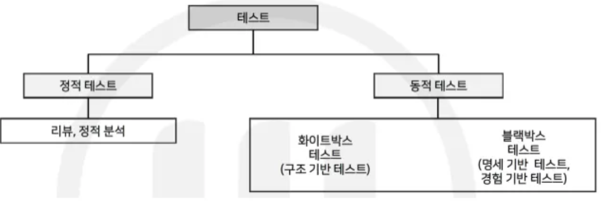

`created at 2021.10.11`

## 1️⃣ 애플리케이션 테스트 케이스 설계

</aside>

**▶ 소프트웨어 테스트 원리 (결완초집 살정오)**

⦁  테스팅은 결함이 존재함을 밝히는 것

⦁  완벽한 테스팅은 불가능

⦁  개발 초기에 테스팅 시작 → 요르돈의 법칙(Snowball Effect, 눈덩이 법칙) : 개발 초기에 테스팅 하지 않으면 비용이 커진다.

⦁  결함 집중 → 파레토 법칙 : 소프트웨어 테스트에서 오류의 80%는 전체 모듈의 20% 내에서 발견된다.

⦁  살충제 패러독스 : 동일한 테스트 케이스로 반복해서 테스트하면 새로운 버그를 찾지 못한다.

⦁  테스팅은 정황에 의존적 : 소프트웨어의 성격에 맞게 테스트 실시

⦁  오류-부재의 궤변 : 요구사항을 충족시키지 못한다면, 결함이 없다고 해도 품질이 높다고 볼 수 없다.

**▶ 소프트웨어 테스트 산출물**

⦁  테스트 계획서(Test Plan)

⦁  테스트 베이시스(Test Basis)

⦁  테스트 케이스(Test Case)

⦁  테스트 슈트(Test Suites)

⦁  테스트 시나리오(Test Scenario)

⦁  테스트 스크립트(Test Script)

⦁  테스트 결과서(Test Result)

---

**▶ 프로그램 실행 여부에 따른 유형**

**▶ 테스트 시각에 따른 분류**

⦁  검증(Verification) : 소프트웨어 개발 과정 테스트, 개발자 혹은 시험자 시각

⦁  확인(Validation) : 소프트웨어 결과 테스트, 사용자 시각

**▶ 테스트 목적에 따른 분류(회안성 구회병)**

⦁  회복 테스트(Recovery) : 시스템에 고의로 실패를 유도하고, 시스템의 정상적 복귀 여부를 테스트

⦁  안전 테스트(Security) : 소스 내 보안적인 결함을 미리 점검하는 테스트

⦁  성능 테스트(Performance) : 응답 시간, 반응 속도, 처리량 등을 측정하는 테스트 (부스스내)

→ 부하 테스트(Load) : 시스템에 부하를 계속 증가시키면서 시스템의 임계점을 찾음

→ 스트레스 테스트(Stress) : 임계점 이상의 부하를 가해 비정상적인 상황에서의 처리를 테스트

→ 스파이크 테스트(Spike) : 짧은 시간에 사용자가 몰릴 때 시스템의 반응 측정 테스트

→ 내구성 테스트(Endurance) : 오랜 시간 동안 시스템에 높은 부하를 가해 테스트

⦁  구조 테스트(Structure) : 시스템의 내부 논리 경로, 소스 코드의 복잡도를 테스트

⦁  회귀 테스트(Regression) : 오류 제거와 수정에 의해 새로 유입된 오류가 없는 지 확인하는 일종의 반복 테스트 기법

⦁  병행 테스트(Parallel) : 변경된 시스템과 기존 시스템에 동일한 데이터 입력 후 결과 비교

**▶ 테스트 종류에 따른 유형**

⦁  명세 기반 테스트 (블랙박스 테스트) : 동경결상 유분페원비

⦁  구조 기반 테스트 (화이트박스 테스트) : 구결조 조변다 기제데

⦁  경험 기반 테스트 (블랙박스 테스트) : 탐색적 테스트, 오류 추정, 체크리스트, 특성 테스트

---

**▶ 정적 테스트 : 리뷰, 정적분석**

**⦁  리뷰** (관리 리뷰, 기술 리뷰, 인스펙션(동료 검토), 워크 스루, 감사)

: 소프트웨어의 다양한 산출물에 존재하는 결함을 검출하거나 프로젝트의 진행 상황을 점검하기 위한 활동으로, 전문가가 수행

⦁ **정적 분석 (**코딩 표준, 복잡도 측정, 자료 흐름 분석)

: 도구의 지원을 받아 정적 테스트 수행

**▶ 동적 테스트 : 화이트 박스, 블랙박스**

⦁  **화이트 박스 테스트(구조 기반 테스트)**

: 각 응용프로그램의 내부 구조와 동작을 검사하는 소프트웨어 테스트

- 테스트 커버리지 : 프로그램의 테스트 수행 정도를 나타내는 값
  : 기능 기반, 라인, 코드 커버리지

⦁  **블랙 박스 테스트(명세 기반 테스트)**

: 외부 사용자의 요구사항 명세를 보면서 수행하는 테스트

**▶ 화이트박스 테스트 유형 (구결조 조변다 기제데)**

⦁  구문(Statement) 커버리지 : 프로그램 내의 모든 명령문을 적어도 한 번 수행하는 커버리지

⦁  결정(선택, 분기)(Decision) 커버리지 : 결정 포인트 내의 전체 조건식이 적어도 한번은 참과 거짓의 결과가 되도록 수행

⦁  조건(Condition) 커버리지 : 결정 포인트 내의 각 개별 조건식이 적어도 한번은 참과 거짓의 결과가 되도록 수행

⦁  조건/결정 커버리지 : 전체 조건식 + 개별 조건식

⦁  변경 조건/결정 커버리지 : 개별 조건식이 다른 개별 조건식에 영향을 받지 않고 전체 조건식에 독립적으로 영향을 주도록 함

⦁  다중 조건(Multiple Condition) 커버리지 : 결정 조건 내 모든 개별 조건식의 모든 가능한 조합을 100% 보장하는 커버리지

⦁  기본 경로(Base Path) 커버리지 : 수행 가능한 모든 경로를 테스트, 멕케이브 순환 복잡도

- 맥케이브 복잡도 : 간선 수(화살표) – 노드 수(원) + 2

⦁  제어 흐름(Control Flow) 테스트 : 프로그램 제어 구조를 그래프 형태로 나타내어 내부 로직 테스트

⦁  데이터 흐름 테스트 : 제어 흐름 그래프에 사용현황 추가

**▶ 블랙박스 테스트 유형 (동경결상 유분페원비)**

⦁  동등 분할(Equivalence Partitioning) 테스트 : 입력 데이터의 영역을 유사한 도메인별로 유효값/무효값을 그룹핑하여 대푯값 테스트 케이스를 도출해 테스트

⦁  경곗값 분석(Boundary Value Analysis) 테스트 : 최솟값 바로 위, 최대치 바로 아래 등 입력값의 극한 한계를 테스트 하는 기법

⦁  결정 테이블(Decision Table) 테스트 : 요구사항의 논리와 발생조건을 테이블 형태로 나열해, 조건과 행위를 모두 조합해 테스트

⦁  상태 전이(State transition) 테스트 : 어느 한 상태에서 다른 상태로 전이 되는 경우의 수를 수행하는 테스트

⦁  유스케이스(Use Case) 테스트 : 프로세스 흐름을 기반으로 테스트 케이스를 명세화해 수행하는 테스트

⦁  분류 트리(Classification Tree Method) 테스트 : SW의 일부 또는 전체를 트리구조로 분석 및 표현하여 테스트 케이스 설계해 테스트

⦁  페어와이즈(Pairwise) 테스트 : 테스트 데이터 값들 간에 최소한 한 번씩을 조합하는 방식

⦁  원인-결과 그래프 테스트 : 그래프를 활용해 입력 데이터 간의 관계 및 출력에 미치는 영향을 분석

⦁  비교(Comparison) 테스트 : 여러 버전의 프로그램에 같은 입력값을 넣어 비교해 테스트

---

**▶ 테스트 케이스**

요구사항에 준수하는 지를 확인하기 위해 개발된 입력값, 실행조건, 예상된 결과의 집합

**▶ 테스트 오라클**

테스트의 결과가 참인지 거짓인지 판단하기 위해 사전에 정의된 참값을 입력하여 비교 하는 기법

**▶ 테스트 오라클 종류**

⦁  참 오라클 : 모든 입력값에 대해 기대하는 결과를 생성함으로써 발생된 오류를 모두 검출

⦁  샘플링 오라클 : 특정한 몇 개의 입력값에 대해서만 기대하는 결과를 제공

⦁  휴리스틱 오라클 : 샘플링 오라클을 개선, + 나머지 값들에 대해서는 휴리스틱(추정) 처리

⦁  일관성 검사 오라클 : 애플리케이션 변경이 있을 때, 수행 전과 후의 결괏값이 동일한지 확인

**▶ 테스트 레벨의 종류 (단통시인)**

단위 테스트, 통합 테스트, 시스템 테스트

⦁  인수 테스트

→ 알파 테스트 : 선택된 사용자가 개발자 환경에서 통제된 상태로 개발자와 함께 수행

→ 베타 테스트 : 실제 환경에서 일정 수의 사용자에게 소프트웨어를 사용하게 하고 피드백을 받는 테스트

**▶ 테스트 시나리오(Test Scenario)**

애플리케이션의 테스트 되어야 할 기능 및 특징, 테스트가 필요한 상황을 작성

## 2️⃣ 애플리케이션 통합 테스트

</aside>

**▶ 목(Mock) 객체**

객체지향 프로그램에서는 컴포넌트 테스트 수행 시 테스트 되는 메서드가 다른 클래스의 객체에 의존한다. 이런 경우 메서드를 고립화하여 테스트하는 것이 불가능하므로 독립적인 컴포넌트 테스트를 위해서는 스텁의 객체지향 버전인 목 객체 가 필요하다.

**▶ 목 객체 유형 (더스드 스가)**

⦁  더미 객체 : 객체만 필요하고 해당 객체의 기능까지는 필요하지 않은 경우 사용

⦁  테스트 스텁 : 제어 모듈이 호출하는 타 모듈의 기능을 단순히 수행하는 도구

⦁  테스트 드라이버 : 테스트 대상 하위 모듈을 호출, 파라미터 전달, 모듈 테스트 수행 후 결과 도출

⦁  테스트 스파이 : 테스트 대상 클래스와 협력하는 클래스

⦁  가짜 객체 : 실체 협력 클래스의 기능을 대체해야 할 경우 사용

**▶ 통합 테스트의 분류**

⦁  빅뱅 테스트 : 모든 모듈을 동시에 통합 후 테스트

⦁  상향식 테스트 – 테스트 드라이버

⦁  하향식 테스트 – 테스트 스텁

⦁  샌드위치 테스트 : 상향식 + 하향식 테스트, 병렬 테스트 가능

---

**▶ 테스트 자동화 도구 유형 (정싱성통)**

⦁  정적 분석 도구(Static Analysis Tools) : 만들어진 애플리케이션을 실행하지 않고 분석, 코딩 표준, 코딩 스타일 등 남은 결함을 발견하기 위해 사용

⦁  테스트 실행 도구(Test Execution Tools) : 작성된 스크립트를 실행

- 데이터 주도 접근 방식, 키워드 주도 접근 방식

⦁  성능 테스트 도구(Performance Test Tools) : 처리량, 응답시간, 경과시간, 자원 사용률에 대해 가상의 사용자를 생성하고 테스트 수행

⦁  테스트 통제 도구(Test Control Tools) : 테스트 관리, 형상 관리, 결함 추적/관리 도구

**▶ 테스트 하네스(Test Harness)**

애플리케이션 컴포넌트 및 모듈을 테스트하는 환경의 일부분으로, 테스트를 지원하기 위한 코드와 데이터를 말하며, 단위 또는 모듈 테스트에 사용하기 위해 코드 개발자가 작성한다.

**▶ 테스트 하네스 구성요소 (드 스슈케 스목)**

⦁  테스트 드라이버, 테스트 스텁

⦁  테스트 슈트 : 테스트 케이스의 집합

⦁  테스트 케이스 : 요구사항에 준수하는 지를 확인하기 위해 개발된 입력값, 실행조건, 예상된 결과의 집합

⦁  테스트 스크립트 : 자동화된 테스트 실행 절차에 대한 명세

⦁  목 오브젝트 : 사용자의 행위를 조건부로 사전 입력해 두면, 그 상황에 예정된 행위 수행

---

**▶ 결함 분석 방법**

⦁  구체화(Specification) : 결함을 발생시킨 입력값, 테스트 절차, 환경을 명확히 파악

⦁  고립화(Isolation) : 어떤 요소가 결함 발생에 영향을 미치는지 분석

⦁  일반화 : 결함 발생에 영향을 주는 요소를 일반화 시키는 방법

**▶ 결함 생명주기**

결함 등록 → 결함 검토 → 결함 할당 → 결함 수정 → 결함 확인 → 결함 재등록 → 결함 조치 → 결함보류

**▶ 결함 추이 분석**

결함 관리 측정 지표의 속성값 들을 분석하고, 향후 애플리케이션의 어떤 모듈 또는 컴포넌트에서 결함이 발생할지를 추정하는 작업

**▶ 결함 추이분석의 유형**

⦁  결함 분포 분석 : 각 APP 모듈 또는 컴포넌트의 특정 속성에 해당하는 결함의 수 측정해 분석

⦁  결함 추세 분석 : 테스트 진행 시간의 흐름에 따른 결함 수 측정해 분석

⦁  결함 에이징 분석 : 등록된 결함에 대해 특정한 결함 상태의 지속 시간을 측정해 분석

**▶ 결함의 분류**

⦁  시스템 결함

⦁  기능 결함

⦁  GUI 결함

⦁  문서 결함

**▶ 결함 심각도별 분류(치주 보경단)**

⦁  치명적(Critical) 결함 : 기능이나 제품의 테스트 완전히 방해, 데이터 손실, 시스템 충돌

⦁  주요(Major) 결함 : 기능이 기대와 다르게 동작

⦁  보통(Normal) 결함 : 일부 기능 부자연스러움, 사소한 기능 오작동

⦁  경미한(Minor) 결함 : 사용상의 불편함 유발, UI 잘림

⦁  단순(Simple) 결함 : 사소한 버그, 미관상 좋지 않음

**▶ 결함 우선순위** : 발생한 결함이 얼마나 빠르게 처리되어야 하는지

⦁  결정적 – 높음 – 보통 – 낮음

## 3️⃣ 애플리케이션 성능 개선

</aside>

**▶ 애플리케이션 성능 측정 지표 (처응경자)**

⦁  처리량(Throughput) : 주어진 시간에 처리할 수 있는 트랜잭션의 수

⦁  응답 시간(Response Time) : 사용자 입력이 끝난 후, APP의 응답 출력이 개시될 때까지의 시간

⦁  경과 시간(Turnaround Time) : 사용자가 요구를 입력한 시점부터 트랜잭션을 처리 후 그 결과의 출력이 완료할 때까지 걸리는 시간

⦁  자원 사용률(Resource Usage) : 애플리케이션이 트랜잭션을 처리하는 동안 사용하는 CPU 사용량, 메모리 사용량, 네트워크 사용량

**▶ 데이터베이스 관련 성능 저하 원인 (락페릭사커)**

⦁  데이터베이스 락 : 대량의 데이터 조회, 과도한 업데이트 시 발생하는 현상

⦁  불필요한 데이터베이스 패치 : 대량의 데이터 요청이 들어올 경우 응답시간 저하 현상 발생

⦁  연결 누수(Leak) : DB연결과 관련한 JDBC 객체를 사용 후 종료하지 않을 경우

⦁  부적절한 커넥션 풀 크기 : 너무 작거나 크게 설정한 경우

⦁  확정 커밋 : 트랜잭션이 커밋되지 않고 커넥션 풀에 반환될 경우

**▶ 애플리케이션 성능 테스트 수행 절차 (도환시성)**

⦁  성능 테스트 도구 설치 : 대상 시스템에 선정된 테스트 도구 설치

⦁  테스트 환경 설정 : 해당 시스템의 운영체제, DBMS버전, 네트워크 상태 등에 대해 설정

⦁  시나리오 생성 : 테스트 목적에 맞는 부하형태, 파라미터, 사용자 수 등의 정보설정

⦁  성능 테스트 실행 및 모니터링 : 선능테스트를 수행하면서 테스트 상황을 도구를 통해 모니터링

---

**▶ 베드 코드**

다른 개발자가 로직을 이해하기 어렵게 작성된 코드

⦁  외계인 코드(Alien Code) : 아주 오래되거나 참고문서 또는 개발자가 없어 유지보수 작업이 어려운 코드

⦁  스파게티 코드 : 스파게티처럼 코드가 복잡하게 얽힘

⦁  알수 없는 변수명, 로직 중복

**▶ 베드 코드 유형 (오문의 결침)**

⦁  오염 : 비지니스 기능을 수행하지 못하는 많은 컴포넌트들이 존재

⦁  문서 부족 : 개발자의 지식 부족

⦁  의미 없는 이름 : 함수, 클래스, 컴포넌트 이름들이 명확한의미를 갖지 못하거나 실제 작동과 불일치

⦁  높은 결합도 : 클래스와 컴포넌트 간에 데이터와 컨트롤 흐름이 네트워크로 복잡하게 연결

⦁  아키텍쳐 침식 : 아키텍쳐상 변형들로 인해 시스템 품질이 떨어짐

**▶ 클린 코드**

잘 작성되어 가독성 높고, 단순하며, 의존성을 줄이고, 중복을 최소화해 잘 정리된 코드클린

⦁  코드 작성원리 : 가독성, 단순성, 의존성 최소, 중복성 제거, 추상화

**▶ 소스 코드 품질분석 도구**

⦁  정적 분석도구

→ pmd : 자바 및 타언어 소스 코드에 대한 버그, 데드코드 분석

→ cppcheck : C/C++ 코드에 대한 메모리 누수, 오버플로우 등 문제 분석

→ SonarQube : 소스 코드 품질 통합 플랫폼, 플러그인 확장가능

→ checkstyle : 자바 코드에 대한 코딩 표준 검사 도구

→ ccm : 다양한 언어의 코드 복잡도 분석 도구, 리눅스, 맥 환경 CLI 형태 지원

→ cobertura : jcoverage 기반의 테스트 커버리지 측정도구

⦁  동적 분석도구

→ Avalanche : Valgrind , STP 기반 소프트웨어 에러 및 취약점 동적 분석 도구

→ Valgrind : 자동화된 메모리 및 스레드 결함 발견 분석 도구

**▶ 리팩토링(Refactoring)**

유지보수 생산성 향상을 목적으로 기능을 변경하지 않고, 복잡한 소스 코드를 수정, 보완해 가용성 및 가독성을 높이는 기법

**▶ 리팩토링의 목적**

⦁  생산성 향상 : 정제 및 최적화된 소스의 재사용

⦁  품질향상 : 소프트웨어 오류 발견이 용이하여 품질향상

⦁  유지보수성 향상 : 복잡한 코드의 단순화, 소스의 가독성 향상

⦁  유연한 시스템 : 소프트웨어 요구사항 변경에 유연한 대응
